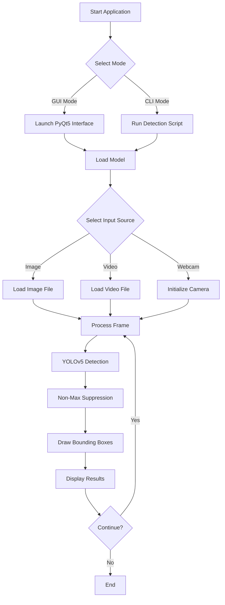
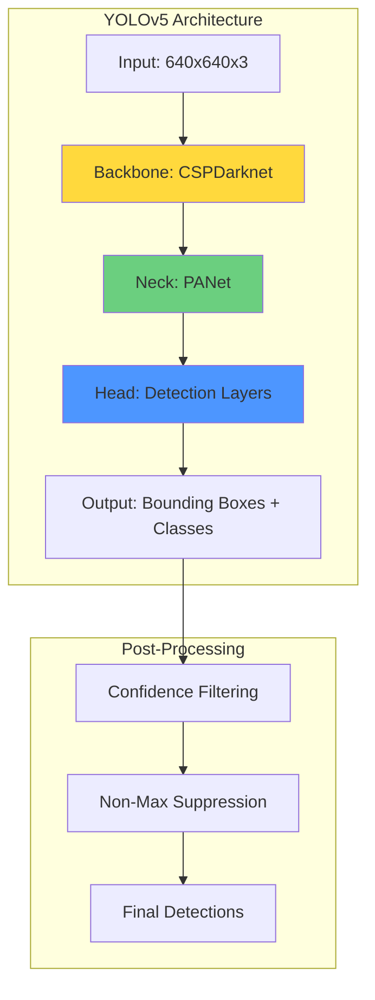
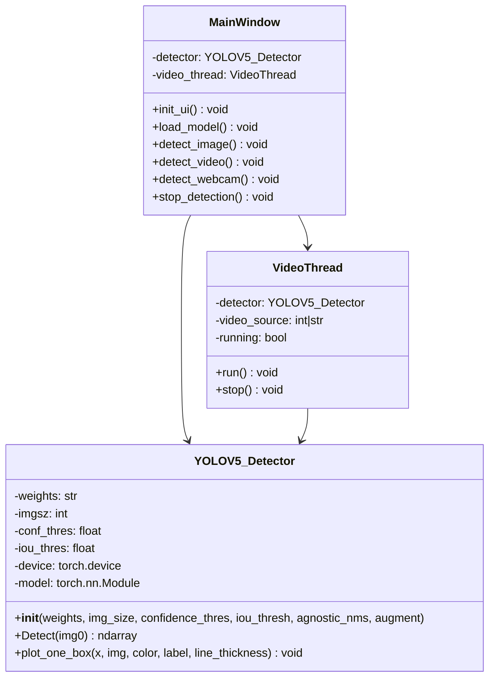
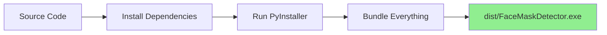
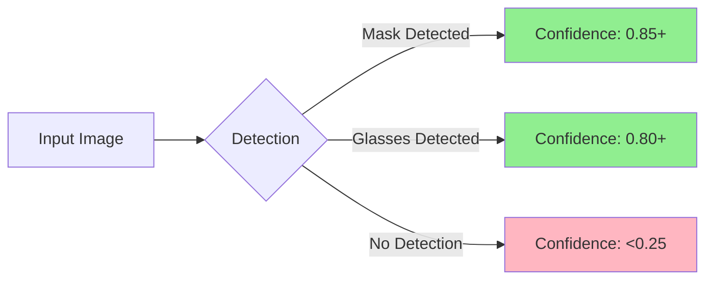

# ✨ Face Mask & Glasses Detector ✨

[](LICENSE)
[](https://www.python.org/)
[](https://github.com/ultralytics/yolov5)
[](https://pytorch.org/)
[](https://github.com/elewashy/Tanta-University/tree/main/Level_3/Semester_1/Digital_Image_Processing/Project/FaceMask_Glasses_Detector)

## 📋 Table of Contents
- [Overview](#overview)
- [Features](#features)
- [Documentation](#documentation)
- [System Architecture](#system-architecture)
- [Quick Start](#quick-start)
- [Installation](#installation)
- [Usage](#usage)
- [Building Executable](#building-executable)
- [Project Structure](#project-structure)
- [Model Information](#model-information)
- [Contributing](#contributing)
- [License](#license)

## 🎯 Overview

This project provides a real-time detection system for identifying people wearing face masks and glasses using deep learning. Built on the YOLOv5 object detection framework, it offers both a command-line interface and a user-friendly GUI application that can be compiled into a standalone executable.

### Key Capabilities
- **Real-time Detection**: Process live webcam feeds with minimal latency
- **Video Processing**: Analyze pre-recorded video files
- **Image Analysis**: Detect masks and glasses in static images
- **Standalone Executable**: Run without Python installation
- **Adjustable Parameters**: Fine-tune confidence and IOU thresholds

## ✨ Features

- 🎥 **Multiple Input Sources**: Webcam, video files, and images
- 🖥️ **GUI Application**: Easy-to-use graphical interface
- 📦 **Standalone EXE**: No Python installation required
- ⚡ **Real-time Performance**: Optimized for speed with Cython
- 🎯 **High Accuracy**: YOLOv5-based detection model
- 🔧 **Configurable**: Adjustable detection parameters
- 💾 **Lightweight**: Efficient resource usage

## 📚 Documentation

Complete documentation is available to help you get started:

| Document | Description | Best For |
|----------|-------------|----------|
| **[Quick Start Guide](docs/QUICK_START.md)** | Get running in 5 minutes | First-time users |
| **[Installation Guide](docs/INSTALLATION_GUIDE.md)** | Detailed setup instructions | Installation help |
| **[User Guide](docs/USER_GUIDE.md)** | Complete feature documentation | Learning all features |
| **[Build Guide](docs/BUILD_GUIDE.md)** | Create standalone executable | Developers & distributors |
| **[Documentation Index](docs/DOCUMENTATION.md)** | API reference & examples | Developers |
| **[Project Summary](docs/PROJECT_SUMMARY.md)** | Project overview & architecture | Project understanding |
| **[FAQ](docs/FAQ.md)** | Frequently asked questions | Quick answers |

**New to the project?** Start with the [Quick Start Guide](docs/QUICK_START.md)!

**Have questions?** Check the [FAQ](docs/FAQ.md) first!

## 🏗️ System Architecture

### Application Flow



### Detection Pipeline

```mermaid
flowchart LR
    A[Input Image] --> B[Preprocessing]
    B --> C[Letterbox Resize]
    C --> D[Normalize]
    D --> E[Convert to Tensor]
    E --> F[YOLOv5 Model]
    F --> G[Raw Predictions]
    G --> H[NMS Filtering]
    H --> I[Scale Coordinates]
    I --> J[Draw Detections]
    J --> K[Output Image]
    
    style F fill:#ff6b6b
    style H fill:#4ecdc4
    style K fill:#95e1d3
```



### Model Architecture



### Class Diagram



## ⚡ Quick Start

### For End Users (No Python Required)

1. Download the latest release
2. Extract and run `FaceMaskDetector.exe`
3. Click "Load Model" and start detecting!

### For Developers


**Need more details?** See the [Quick Start Guide](QUICK_START.md) or [Installation Guide](INSTALLATION_GUIDE.md).

## 🚀 Installation

### Prerequisites
- Python 3.7 or higher
- CUDA-capable GPU (optional, for faster processing)
- Webcam (for live detection)

### Quick Installation

```bash
# Clone and navigate
git clone https://github.com/elewashy/Tanta-University.git
cd Tanta-University/Level_3/Semester_1/Digital_Image_Processing/Project/FaceMask_Glasses_Detector

# Install dependencies
pip install -r requirements.txt

# Run application
python main.py
```

**For detailed installation instructions, troubleshooting, and GPU setup**, see the [Installation Guide](docs/INSTALLATION_GUIDE.md).

## 💻 Usage

### GUI Application (Recommended)

**Windows:**
```bash
run_gui.bat
```

**Or directly:**
```bash
python main.py
```

**GUI Features:**
1. **Load Model**: Select and load the detection model
2. **Adjust Parameters**: Fine-tune confidence and IOU thresholds
3. **Choose Input**: Select image, video, or webcam
4. **View Results**: Real-time detection display

### Quick Scripts

**Webcam Detection:**
```bash
run_webcam.bat
```

**Image Detection:**
```bash
python Detector.py
```

**Video Detection:**
```bash
python "Detection on Video.py"
```

### Code Example

```python
from Detector import YOLOV5_Detector
import cv2

# Initialize detector
detector = YOLOV5_Detector(
    weights='best.pt',
    img_size=640,
    confidence_thres=0.25,
    iou_thresh=0.45,
    agnostic_nms=True,
    augment=True
)

# Detect on image
img = cv2.imread('path/to/image.jpg')
result = detector.Detect(img)
cv2.imshow('Result', result)
cv2.waitKey(0)
```

**For comprehensive usage instructions, advanced features, and examples**, see the [User Guide](docs/USER_GUIDE.md).

## 📦 Building Executable

### Quick Build (Windows)

```bash
build_exe.bat
```

This creates a standalone `.exe` file in the `dist/` folder that runs without Python installation.

### Build Process



### Distribution

The executable in `dist/FaceMaskDetector.exe` can be distributed to users who don't have Python installed.

**For detailed build instructions, customization options, and troubleshooting**, see the [Build Guide](docs/BUILD_GUIDE.md).

## 📁 Project Structure

```
FaceMask_Glasses_Detector/
│
├── 📄 main.py                      # GUI application entry point
├── 📄 Detector.py                  # Core detection class
├── 📄 new_Detector.py              # Alternative detector
├── 📄 Detection on Video.py        # Video detection script
│
├── 📄 build_exe.py                 # Executable build script
├── 📄 build_exe.bat                # Windows build automation
├── 📄 requirements.txt             # Python dependencies
├── 📄 requirements_exe.txt         # EXE build dependencies
│
├── 📄 best.pt                      # Trained model weights
├── 📄 classes.txt                  # Class labels
│
├── 📁 models/                      # YOLOv5 model architectures
│   ├── common.py
│   ├── experimental.py
│   ├── yolo.py
│   └── yolov5*.yaml
│
├── 📁 utils/                       # Utility functions
│   ├── datasets.py
│   ├── general.py
│   ├── torch_utils.py
│   └── ...
│
├── 📁 Dataset/                     # Training dataset
│   ├── images/
│   └── labels/
│
├── 📁 data/                        # Configuration files
│   └── *.yaml
│
└── 📄 README.md                    # This file
```

## 🤖 Model Information

### YOLOv5 Architecture

This project uses YOLOv5, a state-of-the-art object detection model:

- **Backbone**: CSPDarknet53
- **Neck**: PANet (Path Aggregation Network)
- **Head**: YOLOv5 Detection Head
- **Input Size**: 640x640 pixels
- **Classes**: 2 (mask, glasses)

### Training Details

The model was trained on a custom dataset with:
- **Training Images**: Custom face mask and glasses dataset
- **Augmentation**: Mosaic, mixup, rotation, scaling
- **Optimizer**: SGD with momentum
- **Loss Function**: Combined box, objectness, and classification loss

### Performance Metrics



## 🔧 Configuration

### Detection Parameters

| Parameter | Default | Range | Description |
|-----------|---------|-------|-------------|
| `img_size` | 640 | 320-1280 | Input image size |
| `confidence_thres` | 0.25 | 0.0-1.0 | Minimum confidence for detection |
| `iou_thresh` | 0.45 | 0.0-1.0 | IOU threshold for NMS |
| `agnostic_nms` | True | True/False | Class-agnostic NMS |
| `augment` | True | True/False | Test-time augmentation |

### Adjusting Parameters

**Higher Confidence Threshold** (0.5-0.8):
- Fewer false positives
- May miss some detections
- Better for high-precision requirements

**Lower Confidence Threshold** (0.1-0.3):
- More detections
- More false positives
- Better for high-recall requirements

## 🐛 Troubleshooting

### Common Issues

**Issue**: Model file not found
```
Solution: Ensure best.pt is in the project root directory
```

**Issue**: CUDA out of memory
```
Solution: Reduce img_size or use CPU mode
```

**Issue**: Webcam not detected
```
Solution: Check camera permissions and drivers
```

**Issue**: Slow detection speed
```
Solution: 
- Use GPU if available
- Reduce image size
- Disable augmentation
```