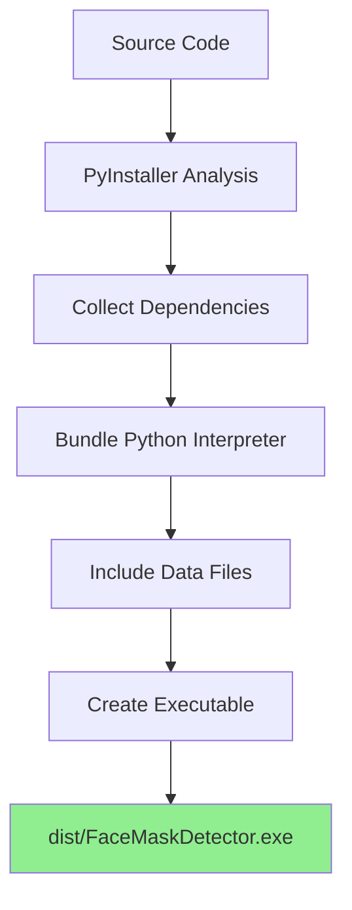
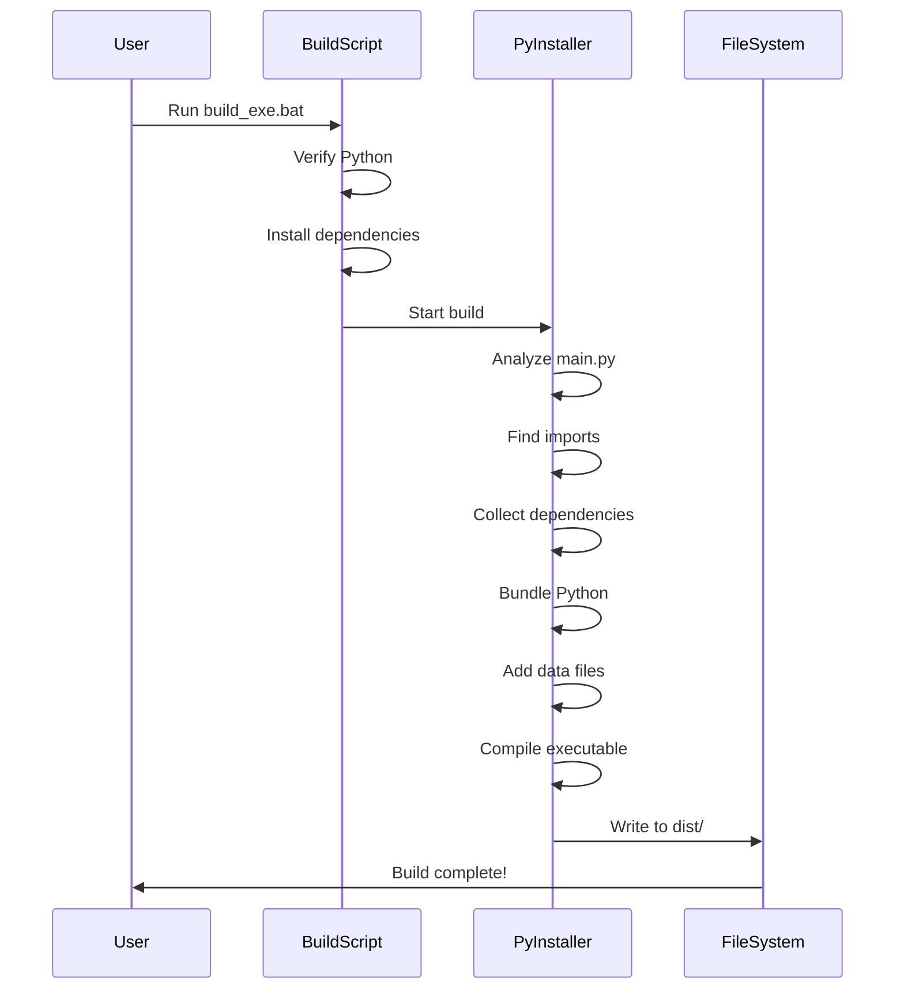

# 🔨 Build Guide

Complete guide for building a standalone executable from the Face Mask & Glasses Detector.

## Table of Contents
- [Overview](#overview)
- [Prerequisites](#prerequisites)
- [Build Process](#build-process)
- [Customization](#customization)
- [Distribution](#distribution)
- [Troubleshooting](#troubleshooting)

## 📋 Overview

This guide explains how to create a standalone Windows executable (.exe) that can run without Python installation.

### What Gets Built

```
dist/
└── FaceMaskDetector.exe  (Single executable file)
```

### Build Process Flow



## 🔧 Prerequisites

### Required Software

1. **Python 3.7+**
   ```bash
   python --version
   ```

2. **PyInstaller**
   ```bash
   pip install pyinstaller>=5.0.0
   ```

3. **All Project Dependencies**
   ```bash
   pip install -r requirements_exe.txt
   ```

### Verify Installation

```bash
python -c "import PyInstaller; print('PyInstaller OK')"
python -c "import torch; print('PyTorch OK')"
python -c "import cv2; print('OpenCV OK')"
python -c "import PyQt5; print('PyQt5 OK')"
```

## 🚀 Build Process

### Method 1: Automated Build (Recommended)

**Windows:**
```bash
build_exe.bat
```

This script will:
1. Check Python installation
2. Install requirements
3. Run PyInstaller
4. Create executable in `dist/` folder

### Method 2: Python Script

```bash
python build_exe.py
```

### Method 3: Manual PyInstaller

```bash
pyinstaller --name=FaceMaskDetector ^
            --onefile ^
            --windowed ^
            --add-data="best.pt;." ^
            --add-data="classes.txt;." ^
            --add-data="models;models" ^
            --add-data="utils;utils" ^
            --hidden-import=torch ^
            --hidden-import=torchvision ^
            --hidden-import=cv2 ^
            --hidden-import=PyQt5 ^
            main.py
```

### Build Steps Explained



## ⚙️ Customization

### Modify Build Script

Edit `build_exe.py` to customize:

#### 1. Executable Name

```python
args = [
    'main.py',
    '--name=MyCustomName',  # Change this
    # ...
]
```

#### 2. Add Icon

```python
args = [
    'main.py',
    '--icon=icon.ico',  # Add your icon
    # ...
]
```

#### 3. Console Window

```python
# Show console (for debugging)
'--console',

# Hide console (for release)
'--windowed',
```

#### 4. Single File vs Directory

```python
# Single executable file
'--onefile',

# Directory with dependencies
'--onedir',
```

#### 5. Additional Data Files

```python
'--add-data=config.yaml;.',
'--add-data=images;images',
```

### Advanced Configuration

Create `FaceMaskDetector.spec` file:

```python
# -*- mode: python ; coding: utf-8 -*-

block_cipher = None

a = Analysis(
    ['main.py'],
    pathex=[],
    binaries=[],
    datas=[
        ('best.pt', '.'),
        ('classes.txt', '.'),
        ('models', 'models'),
        ('utils', 'utils'),
    ],
    hiddenimports=[
        'torch',
        'torchvision',
        'cv2',
        'PyQt5',
        'numpy',
        'PIL',
    ],
    hookspath=[],
    hooksconfig={},
    runtime_hooks=[],
    excludes=['pytest', 'notebook', 'IPython'],
    win_no_prefer_redirects=False,
    win_private_assemblies=False,
    cipher=block_cipher,
    noarchive=False,
)

pyz = PYZ(a.pure, a.zipped_data, cipher=block_cipher)

exe = EXE(
    pyz,
    a.scripts,
    a.binaries,
    a.zipfiles,
    a.datas,
    [],
    name='FaceMaskDetector',
    debug=False,
    bootloader_ignore_signals=False,
    strip=False,
    upx=True,
    upx_exclude=[],
    runtime_tmpdir=None,
    console=False,
    disable_windowed_traceback=False,
    argv_emulation=False,
    target_arch=None,
    codesign_identity=None,
    entitlements_file=None,
    icon='icon.ico'  # Optional
)
```

Build with spec file:
```bash
pyinstaller FaceMaskDetector.spec
```

## 📦 Distribution

### Package for Distribution

1. **Create Distribution Folder**
   ```
   FaceMaskDetector_v1.0/
   ├── FaceMaskDetector.exe
   ├── best.pt
   ├── classes.txt
   ├── README.txt
   └── LICENSE.txt
   ```

2. **Create README.txt**
   ```text
   Face Mask & Glasses Detector v1.0
   
   Quick Start:
   1. Double-click FaceMaskDetector.exe
   2. Click "Load Model"
   3. Choose detection mode
   
   Requirements:
   - Windows 10/11
   - Webcam (for live detection)
   
   Support: [GitHub URL]
   ```

3. **Compress to ZIP**
   ```bash
   # Windows
   Compress-Archive -Path FaceMaskDetector_v1.0 -DestinationPath FaceMaskDetector_v1.0.zip
   
   # Linux/Mac
   zip -r FaceMaskDetector_v1.0.zip FaceMaskDetector_v1.0/
   ```

### File Size Optimization

#### Reduce Executable Size

1. **Exclude Unnecessary Modules**
   ```python
   '--exclude-module=pytest',
   '--exclude-module=notebook',
   '--exclude-module=IPython',
   '--exclude-module=matplotlib',  # If not needed
   ```

2. **Use UPX Compression**
   ```bash
   # Install UPX
   # Download from: https://upx.github.io/
   
   # PyInstaller will use it automatically
   '--upx-dir=path/to/upx',
   ```

3. **One Directory Build** (smaller than onefile)
   ```python
   '--onedir',  # Instead of --onefile
   ```

### Distribution Checklist

- [ ] Test executable on clean Windows machine
- [ ] Verify all features work
- [ ] Check model file is included
- [ ] Test with different input sources
- [ ] Create user documentation
- [ ] Add version information
- [ ] Include license file
- [ ] Create installer (optional)

## 🐛 Troubleshooting

### Build Errors

#### Error: "Module not found"

**Solution:**
```bash
# Add to hidden imports
'--hidden-import=missing_module',
```

#### Error: "Failed to execute script"

**Solution:**
```bash
# Build with console to see errors
'--console',  # Instead of --windowed
```

#### Error: "Data file not found"

**Solution:**
```python
# Check data file paths
'--add-data=source;destination',
```

### Runtime Errors

#### Error: "best.pt not found"

**Solution:**
- Ensure model file is in same directory as exe
- Check `--add-data` includes model file
- Verify file path in code

#### Error: "DLL load failed"

**Solution:**
```bash
# Install Visual C++ Redistributable
# Download from Microsoft website
```

#### Error: "CUDA not available"

**Solution:**
- Build includes CPU version of PyTorch
- GPU support requires CUDA installation on target machine
- Consider separate GPU and CPU builds

### Performance Issues

#### Large Executable Size

**Solutions:**
1. Use `--onedir` instead of `--onefile`
2. Exclude unnecessary modules
3. Use UPX compression
4. Remove debug symbols

#### Slow Startup

**Solutions:**
1. Use `--onedir` build
2. Reduce number of imports
3. Lazy load heavy modules

## 📊 Build Comparison

| Build Type | Size | Startup | Distribution |
|------------|------|---------|--------------|
| --onefile | ~500MB | Slower | Single file |
| --onedir | ~400MB | Faster | Multiple files |
| --onefile + UPX | ~350MB | Slower | Single file |

## 🔄 Continuous Integration

### GitHub Actions Example

```yaml
name: Build Executable

on:
  push:
    tags:
      - 'v*'

jobs:
  build:
    runs-on: windows-latest
    
    steps:
    - uses: actions/checkout@v2
    
    - name: Set up Python
      uses: actions/setup-python@v2
      with:
        python-version: 3.8
    
    - name: Install dependencies
      run: |
        pip install -r requirements_exe.txt
    
    - name: Build executable
      run: |
        python build_exe.py
    
    - name: Upload artifact
      uses: actions/upload-artifact@v2
      with:
        name: FaceMaskDetector
        path: dist/FaceMaskDetector.exe
```

## 📝 Version Management

### Add Version Information

Create `version.txt`:
```
VSVersionInfo(
  ffi=FixedFileInfo(
    filevers=(1, 0, 0, 0),
    prodvers=(1, 0, 0, 0),
    mask=0x3f,
    flags=0x0,
    OS=0x40004,
    fileType=0x1,
    subtype=0x0,
    date=(0, 0)
  ),
  kids=[
    StringFileInfo([
      StringTable(
        u'040904B0',
        [StringStruct(u'CompanyName', u'Your Company'),
        StringStruct(u'FileDescription', u'Face Mask Detector'),
        StringStruct(u'FileVersion', u'1.0.0.0'),
        StringStruct(u'ProductName', u'Face Mask Detector'),
        StringStruct(u'ProductVersion', u'1.0.0.0')])
    ]),
    VarFileInfo([VarStruct(u'Translation', [1033, 1200])])
  ]
)
```

Add to build:
```python
'--version-file=version.txt',
```

After successful build:

1. Test on multiple Windows versions
2. Create installer with NSIS or Inno Setup
3. Set up auto-update mechanism
4. Create user documentation
5. Publish release on GitHub

For more information:
- [User Guide](USER_GUIDE.md) for usage instructions
- [Installation Guide](INSTALLATION_GUIDE.md) for setup help
- [FAQ](FAQ.md) for common questions

---

**Happy Building! 🚀**
