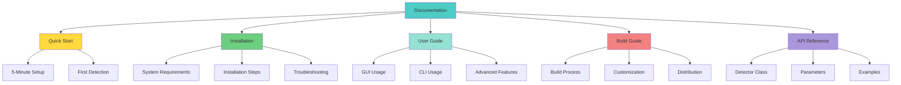

# 📚 Documentation Index

Complete documentation for the Face Mask & Glasses Detector project.

## 📖 Documentation Structure



## 🚀 Getting Started

### New Users
1. **[Quick Start Guide](QUICK_START.md)** - Get running in 5 minutes
2. **[Installation Guide](INSTALLATION_GUIDE.md)** - Detailed setup instructions
3. **[User Guide](USER_GUIDE.md)** - Learn all features

### Developers
1. **[Quick Start Guide](QUICK_START.md)** - Setup development environment
2. **[API Reference](#api-reference)** - Code documentation
3. **[Build Guide](BUILD_GUIDE.md)** - Create executables

## 📋 Document Overview

### [README.md](README.md)
**Main project documentation**
- Project overview
- Features and capabilities
- System architecture with flowcharts
- Quick installation
- Basic usage examples
- Model information
- Contributing guidelines

**Best for**: First-time visitors, project overview

### [QUICK_START.md](QUICK_START.md)
**Get running in 5 minutes**
- Fastest path to first detection
- Simple examples
- Common tasks
- Quick troubleshooting

**Best for**: Users who want to start immediately

### [INSTALLATION_GUIDE.md](INSTALLATION_GUIDE.md)
**Complete installation instructions**
- System requirements
- Multiple installation methods
- GPU setup
- Verification steps
- Detailed troubleshooting
- Update procedures

**Best for**: Users having installation issues

### [USER_GUIDE.md](USER_GUIDE.md)
**Comprehensive usage documentation**
- GUI application tutorial
- Command-line usage
- Advanced features
- Parameter tuning
- Best practices
- Performance optimization

**Best for**: Users wanting to master the application

### [BUILD_GUIDE.md](BUILD_GUIDE.md)
**Executable creation guide**
- Build process explanation
- Customization options
- Distribution packaging
- Size optimization
- CI/CD integration

**Best for**: Developers creating executables

## 🎯 Quick Navigation

### By User Type

#### End Users (No Coding)
```
1. QUICK_START.md → Use the executable
2. USER_GUIDE.md → GUI Application section
3. README.md → Troubleshooting
```

#### Python Developers
```
1. QUICK_START.md → Developer setup
2. INSTALLATION_GUIDE.md → Python installation
3. USER_GUIDE.md → CLI Usage
4. API Reference → Code examples
```

#### Application Builders
```
1. INSTALLATION_GUIDE.md → Setup environment
2. BUILD_GUIDE.md → Build executable
3. BUILD_GUIDE.md → Distribution
```

### By Task

#### "I want to detect masks in my photos"
→ [QUICK_START.md](QUICK_START.md) → Task 1

#### "I want to monitor my webcam"
→ [QUICK_START.md](QUICK_START.md) → Task 2

#### "I want to create an executable"
→ [BUILD_GUIDE.md](BUILD_GUIDE.md) → Build Process

#### "I'm getting errors during installation"
→ [INSTALLATION_GUIDE.md](INSTALLATION_GUIDE.md) → Troubleshooting

#### "I want to improve detection accuracy"
→ [USER_GUIDE.md](USER_GUIDE.md) → Advanced Features

#### "I want to process multiple videos"
→ [USER_GUIDE.md](USER_GUIDE.md) → Batch Processing

## 🔧 API Reference

### YOLOV5_Detector Class

#### Constructor

```python
YOLOV5_Detector(
    weights: str,           # Path to model weights
    img_size: int,          # Input image size
    confidence_thres: float,# Confidence threshold
    iou_thresh: float,      # IOU threshold for NMS
    agnostic_nms: bool,     # Class-agnostic NMS
    augment: bool           # Test-time augmentation
)
```

**Parameters:**

| Parameter | Type | Default | Description |
|-----------|------|---------|-------------|
| `weights` | str | Required | Path to .pt model file |
| `img_size` | int | 640 | Input image size (320-1280) |
| `confidence_thres` | float | 0.25 | Min confidence (0.0-1.0) |
| `iou_thresh` | float | 0.45 | IOU threshold (0.0-1.0) |
| `agnostic_nms` | bool | True | Class-agnostic NMS |
| `augment` | bool | True | Test-time augmentation |

**Example:**
```python
detector = YOLOV5_Detector(
    weights='best.pt',
    img_size=640,
    confidence_thres=0.25,
    iou_thresh=0.45,
    agnostic_nms=True,
    augment=True
)
```

#### Methods

##### Detect()

```python
def Detect(img0: np.ndarray) -> np.ndarray
```

Performs detection on input image.

**Parameters:**
- `img0` (np.ndarray): Input image in BGR format

**Returns:**
- `np.ndarray`: Image with drawn bounding boxes

**Example:**
```python
import cv2

img = cv2.imread('image.jpg')
result = detector.Detect(img)
cv2.imshow('Result', result)
cv2.waitKey(0)
```

##### plot_one_box()

```python
def plot_one_box(
    x: list,              # Bounding box coordinates
    img: np.ndarray,      # Image to draw on
    color: tuple = None,  # Box color (B, G, R)
    label: str = None,    # Label text
    line_thickness: int = 3  # Line thickness
) -> None
```

Draws a single bounding box on image.

**Example:**
```python
detector.plot_one_box(
    x=[100, 100, 200, 200],
    img=image,
    color=(0, 255, 0),
    label='mask',
    line_thickness=3
)
```

### Complete Examples

#### Example 1: Basic Image Detection

```python
from Detector import YOLOV5_Detector
import cv2

# Initialize
detector = YOLOV5_Detector(
    weights='best.pt',
    img_size=640,
    confidence_thres=0.25,
    iou_thresh=0.45,
    agnostic_nms=True,
    augment=True
)

# Load and detect
img = cv2.imread('photo.jpg')
result = detector.Detect(img)

# Display
cv2.imshow('Detection', result)
cv2.waitKey(0)
cv2.destroyAllWindows()
```

#### Example 2: Video Processing

```python
from Detector import YOLOV5_Detector
import cv2

detector = YOLOV5_Detector(
    weights='best.pt',
    img_size=640,
    confidence_thres=0.3,
    iou_thresh=0.45,
    agnostic_nms=True,
    augment=True
)

cap = cv2.VideoCapture('video.mp4')

while cap.isOpened():
    ret, frame = cap.read()
    if not ret:
        break
    
    result = detector.Detect(frame)
    cv2.imshow('Detection', result)
    
    if cv2.waitKey(1) & 0xFF == ord('q'):
        break

cap.release()
cv2.destroyAllWindows()
```

#### Example 3: Webcam with Custom Settings

```python
from Detector import YOLOV5_Detector
import cv2

# High confidence for fewer false positives
detector = YOLOV5_Detector(
    weights='best.pt',
    img_size=640,
    confidence_thres=0.6,  # Stricter
    iou_thresh=0.5,
    agnostic_nms=True,
    augment=False  # Faster
)

cap = cv2.VideoCapture(0)

while True:
    ret, frame = cap.read()
    if ret:
        result = detector.Detect(frame)
        cv2.imshow('Webcam Detection', result)
        
        if cv2.waitKey(1) & 0xFF == ord('q'):
            break

cap.release()
cv2.destroyAllWindows()
```

#### Example 4: Batch Processing

```python
from Detector import YOLOV5_Detector
import cv2
import os

detector = YOLOV5_Detector(
    weights='best.pt',
    img_size=640,
    confidence_thres=0.25,
    iou_thresh=0.45,
    agnostic_nms=True,
    augment=True
)

input_dir = 'input_images'
output_dir = 'output_images'
os.makedirs(output_dir, exist_ok=True)

for filename in os.listdir(input_dir):
    if filename.endswith(('.jpg', '.png', '.jpeg')):
        # Load image
        img_path = os.path.join(input_dir, filename)
        img = cv2.imread(img_path)
        
        # Detect
        result = detector.Detect(img)
        
        # Save result
        output_path = os.path.join(output_dir, filename)
        cv2.imwrite(output_path, result)
        
        print(f'Processed: {filename}')

print('Batch processing complete!')
```

#### Example 5: Save Video Output

```python
from Detector import YOLOV5_Detector
import cv2

detector = YOLOV5_Detector(
    weights='best.pt',
    img_size=640,
    confidence_thres=0.25,
    iou_thresh=0.45,
    agnostic_nms=True,
    augment=True
)

# Input video
cap = cv2.VideoCapture('input.mp4')

# Get video properties
fps = int(cap.get(cv2.CAP_PROP_FPS))
width = int(cap.get(cv2.CAP_PROP_FRAME_WIDTH))
height = int(cap.get(cv2.CAP_PROP_FRAME_HEIGHT))

# Output video
fourcc = cv2.VideoWriter_fourcc(*'mp4v')
out = cv2.VideoWriter('output.mp4', fourcc, fps, (width, height))

while cap.isOpened():
    ret, frame = cap.read()
    if not ret:
        break
    
    result = detector.Detect(frame)
    out.write(result)
    
    # Optional: display progress
    cv2.imshow('Processing', result)
    if cv2.waitKey(1) & 0xFF == ord('q'):
        break

cap.release()
out.release()
cv2.destroyAllWindows()
```

## 🔍 Search Documentation

### By Keyword

- **Installation**: [INSTALLATION_GUIDE.md](INSTALLATION_GUIDE.md)
- **GUI**: [USER_GUIDE.md](USER_GUIDE.md) → GUI Application
- **Webcam**: [QUICK_START.md](QUICK_START.md) → Webcam Detection
- **Video**: [USER_GUIDE.md](USER_GUIDE.md) → Video Detection
- **Build**: [BUILD_GUIDE.md](BUILD_GUIDE.md)
- **Executable**: [BUILD_GUIDE.md](BUILD_GUIDE.md) → Build Process
- **Parameters**: [USER_GUIDE.md](USER_GUIDE.md) → Model Settings
- **Troubleshooting**: [INSTALLATION_GUIDE.md](INSTALLATION_GUIDE.md) → Troubleshooting
- **Performance**: [USER_GUIDE.md](USER_GUIDE.md) → Performance Optimization
- **API**: [DOCUMENTATION.md](DOCUMENTATION.md) → API Reference

## 📞 Getting Help

### Documentation Not Enough?

1. **Search Issues**: Check [GitHub Issues](https://github.com/elewashy/Tanta-University/issues)
2. **Ask Question**: Open a new issue
3. **Contribute**: Improve documentation via PR

### Contributing to Documentation

We welcome documentation improvements!

1. Fork the repository
2. Edit markdown files
3. Submit pull request
4. Follow markdown style guide

## 📊 Documentation Statistics

| Document | Pages | Topics | Examples |
|----------|-------|--------|----------|
| README.md | 1 | 10 | 5 |
| QUICK_START.md | 1 | 8 | 10 |
| INSTALLATION_GUIDE.md | 1 | 12 | 15 |
| USER_GUIDE.md | 1 | 20 | 25 |
| BUILD_GUIDE.md | 1 | 15 | 20 |
| DOCUMENTATION.md | 1 | 8 | 30 |

**Total**: 6 documents, 73 topics, 105 examples

## 🎓 Learning Path

### Beginner Path
```
1. README.md (Overview)
2. QUICK_START.md (First detection)
3. USER_GUIDE.md (GUI basics)
4. Practice with examples
```

### Intermediate Path
```
1. INSTALLATION_GUIDE.md (Proper setup)
2. USER_GUIDE.md (All features)
3. API Reference (Code examples)
4. Build custom scripts
```

### Advanced Path
```
1. BUILD_GUIDE.md (Create executable)
2. API Reference (Advanced usage)
3. Customize and extend
4. Contribute to project
```

---

**Happy Learning! 📚**
