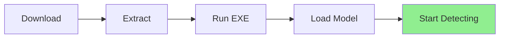

# ⚡ Quick Start Guide

Get up and running in 5 minutes!

## 🎯 For End Users (No Coding Required)

### Option 1: Use the Executable

1. **Download** the latest release
2. **Extract** the ZIP file
3. **Double-click** `FaceMaskDetector.exe`
4. **Click** "Load Model"
5. **Choose** your detection mode:
   - 📷 Webcam for live detection
   - 🎥 Video for file processing
   - 🖼️ Image for single photos

**That's it!** You're detecting masks and glasses.



## 💻 For Developers

### 3-Step Setup

```bash
# 1. Clone and navigate
git clone https://github.com/elewashy/Tanta-University.git
cd Tanta-University/Level_3/Semester_1/Digital_Image_Processing/Project/FaceMask_Glasses_Detector

# 2. Install dependencies
pip install -r requirements.txt

# 3. Run the application
python main.py
```

### First Detection

```python
from Detector import YOLOV5_Detector
import cv2

# Initialize detector
detector = YOLOV5_Detector(
    weights='best.pt',
    img_size=640,
    confidence_thres=0.25,
    iou_thresh=0.45,
    agnostic_nms=True,
    augment=True
)

# Detect on image
img = cv2.imread('your_image.jpg')
result = detector.Detect(img)
cv2.imshow('Result', result)
cv2.waitKey(0)
```

## 🏗️ Build Your Own Executable

```bash
# Install build requirements
pip install -r requirements_exe.txt

# Run build script
python build_exe.py

# Find your executable in dist/
```

## 🎮 Usage Examples

### Webcam Detection
```bash
python "Detection on Video.py"
# Set video_path = 0 in the script
```

### Video File Detection
```bash
python "Detection on Video.py"
# Set video_path = 'your_video.mp4' in the script
```

### Image Detection
```bash
python Detector.py
# Edit the image path in the script
```

## ⚙️ Quick Settings

### Adjust Detection Sensitivity

**More Strict** (fewer false positives):
```python
confidence_thres=0.6  # Higher = stricter
```

**More Lenient** (catch more detections):
```python
confidence_thres=0.2  # Lower = more detections
```

### Speed vs Accuracy

**Faster Processing**:
```python
img_size=320  # Smaller = faster
augment=False  # Disable augmentation
```

**Better Accuracy**:
```python
img_size=640  # Larger = more accurate
augment=True   # Enable augmentation
```

## 🎯 Common Tasks

### Task 1: Detect Masks in a Photo

1. Open `Detector.py`
2. Change line: `img = cv2.imread('your_photo.jpg')`
3. Run: `python Detector.py`

### Task 2: Monitor Webcam

1. Run: `python "Detection on Video.py"`
2. Ensure `video_path = 0`
3. Press 'q' to quit

### Task 3: Process Video File

1. Open `Detection on Video.py`
2. Set: `video_path = 'your_video.mp4'`
3. Run: `python "Detection on Video.py"`

### Task 4: Batch Process Images

```python
import os
import cv2
from Detector import YOLOV5_Detector

detector = YOLOV5_Detector(weights='best.pt', img_size=640, 
                           confidence_thres=0.25, iou_thresh=0.45,
                           agnostic_nms=True, augment=True)

for img_file in os.listdir('input_folder'):
    img = cv2.imread(f'input_folder/{img_file}')
    result = detector.Detect(img)
    cv2.imwrite(f'output_folder/{img_file}', result)
```

## 🚨 Quick Troubleshooting

| Problem | Quick Fix |
|---------|-----------|
| No detections | Lower confidence threshold |
| Too many false positives | Raise confidence threshold |
| Slow performance | Reduce img_size to 320 |
| Camera not working | Check permissions, try index 1 |
| Model not found | Ensure best.pt is in root folder |

## 📚 Learn More

- **Full Documentation**: [README.md](../README.md)
- **Detailed Guide**: [USER_GUIDE.md](USER_GUIDE.md)
- **Installation Help**: [INSTALLATION_GUIDE.md](INSTALLATION_GUIDE.md)
- **Build Instructions**: [BUILD_GUIDE.md](BUILD_GUIDE.md)

## 🎉 You're Ready!

Start detecting masks and glasses in your images and videos. Experiment with different settings to find what works best for your use case.

---

**Questions?** Check the documentation or open an issue on GitHub.
