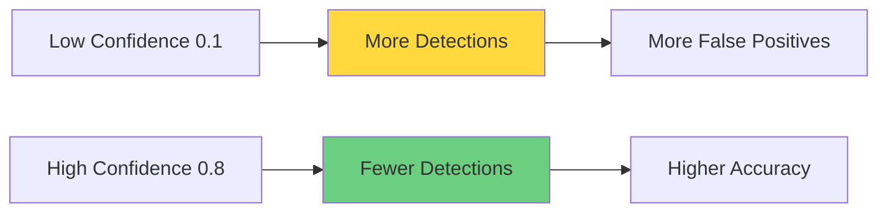
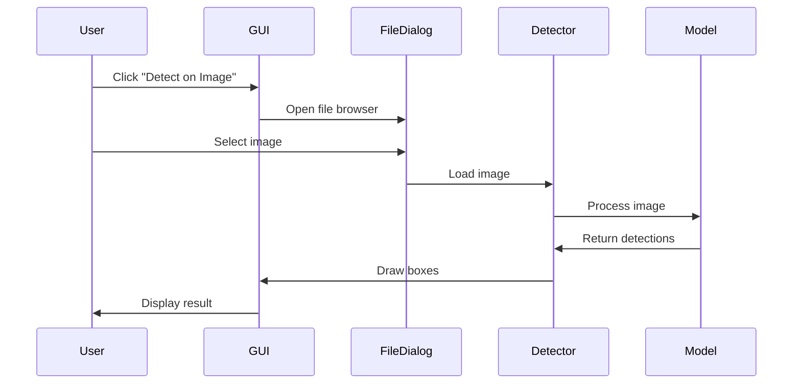

# 📖 User Guide

Comprehensive guide for using the Face Mask & Glasses Detector application.

## Table of Contents
- [Getting Started](#getting-started)
- [GUI Application](#gui-application)
- [Command Line Usage](#command-line-usage)
- [Advanced Features](#advanced-features)
- [Tips & Best Practices](#tips--best-practices)

## 🚀 Getting Started

### First Launch

1. **Start the Application**
   ```bash
   python main.py
   ```
   Or double-click `FaceMaskDetector.exe` if using the executable.

2. **Load the Model**
   - Click "Load Model" button
   - Wait for model initialization (5-10 seconds)
   - Status will show "Model loaded successfully"

3. **Choose Detection Mode**
   - Image: Single image analysis
   - Video: Pre-recorded video processing
   - Webcam: Real-time detection

## 🖥️ GUI Application

### Interface Overview

```
┌─────────────────────────────────────────────────────────┐
│  Face Mask & Glasses Detector                           │
├──────────────┬──────────────────────────────────────────┤
│              │                                           │
│  Model       │                                           │
│  Settings    │         Display Area                      │
│              │                                           │
│  ┌────────┐  │                                           │
│  │ Load   │  │                                           │
│  │ Model  │  │                                           │
│  └────────┘  │                                           │
│              │                                           │
│  Detection   │                                           │
│  Options     │                                           │
│              │                                           │
│  ┌────────┐  │                                           │
│  │ Image  │  │                                           │
│  │ Video  │  │                                           │
│  │ Webcam │  │                                           │
│  │ Stop   │  │                                           │
│  └────────┘  │                                           │
│              │                                           │
│  Status      │                                           │
└──────────────┴──────────────────────────────────────────┘
```

### Model Settings Panel

#### 1. Model Selection
- **best.pt**: Main trained model (recommended)
- **model/best.pt**: Alternative model location

#### 2. Confidence Threshold
- **Range**: 0.01 - 1.00
- **Default**: 0.25
- **Purpose**: Minimum confidence for detection

**When to adjust:**
- **Increase (0.5-0.8)**: Reduce false positives, stricter detection
- **Decrease (0.1-0.3)**: Catch more detections, may include false positives



#### 3. IOU Threshold
- **Range**: 0.01 - 1.00
- **Default**: 0.45
- **Purpose**: Overlap threshold for Non-Max Suppression

**When to adjust:**
- **Increase (0.6-0.8)**: Keep overlapping boxes, detect crowded scenes
- **Decrease (0.2-0.4)**: Remove overlapping boxes, cleaner output

### Detection Modes

#### Image Detection

**Steps:**
1. Click "Detect on Image"
2. Browse and select image file
3. View results in display area
4. Detection boxes show:
   - Red box: Mask detected
   - Blue box: Glasses detected
   - Label with class name

**Supported Formats:**
- PNG (.png)
- JPEG (.jpg, .jpeg)
- BMP (.bmp)

**Example Workflow:**


#### Video Detection

**Steps:**
1. Click "Detect on Video"
2. Select video file
3. Processing starts automatically
4. Click "Stop Detection" to end

**Supported Formats:**
- MP4 (.mp4)
- AVI (.avi)
- MOV (.mov)

**Performance Tips:**
- Lower resolution videos process faster
- GPU acceleration recommended for HD videos
- Adjust confidence threshold for better results

#### Webcam Detection

**Steps:**
1. Click "Detect on Webcam"
2. Allow camera access if prompted
3. Real-time detection starts
4. Click "Stop Detection" to end

**Requirements:**
- Working webcam
- Camera permissions enabled
- Good lighting conditions

**Optimal Setup:**
- Distance: 1-2 meters from camera
- Lighting: Front-facing, even lighting
- Background: Plain, uncluttered

## 💻 Command Line Usage

### Basic Image Detection

Edit `Detector.py`:
```python
detector = YOLOV5_Detector(
    weights='best.pt',
    img_size=640,
    confidence_thres=0.25,
    iou_thresh=0.45,
    agnostic_nms=True,
    augment=True
)

img = cv2.imread('path/to/your/image.jpg')
detector.Detect(img)
```

Run:
```bash
python Detector.py
```

### Video/Webcam Detection

Edit `Detection on Video.py`:
```python
# For webcam
video_path = 0

# For video file
video_path = 'path/to/video.mp4'
```

Run:
```bash
python "Detection on Video.py"
```

**Keyboard Controls:**
- Press 'q' to quit

### Custom Script

```python
from Detector import YOLOV5_Detector
import cv2

# Initialize
detector = YOLOV5_Detector(
    weights='best.pt',
    img_size=640,
    confidence_thres=0.3,
    iou_thresh=0.45,
    agnostic_nms=True,
    augment=True
)

# Process video
cap = cv2.VideoCapture('video.mp4')
while cap.isOpened():
    ret, frame = cap.read()
    if not ret:
        break
    
    result = detector.Detect(frame)
    cv2.imshow('Detection', result)
    
    if cv2.waitKey(1) & 0xFF == ord('q'):
        break

cap.release()
cv2.destroyAllWindows()
```

## 🎯 Advanced Features

### Batch Processing

Process multiple images:

```python
import os
import cv2
from Detector import YOLOV5_Detector

detector = YOLOV5_Detector(
    weights='best.pt',
    img_size=640,
    confidence_thres=0.25,
    iou_thresh=0.45,
    agnostic_nms=True,
    augment=True
)

input_folder = 'input_images'
output_folder = 'output_images'
os.makedirs(output_folder, exist_ok=True)

for filename in os.listdir(input_folder):
    if filename.endswith(('.jpg', '.png', '.jpeg')):
        img_path = os.path.join(input_folder, filename)
        img = cv2.imread(img_path)
        result = detector.Detect(img)
        
        output_path = os.path.join(output_folder, filename)
        cv2.imwrite(output_path, result)
        print(f"Processed: {filename}")
```

### Save Detection Results

```python
# After detection
cv2.imwrite('output.jpg', result)
```

### Video Output

```python
# Setup video writer
fourcc = cv2.VideoWriter_fourcc(*'mp4v')
out = cv2.VideoWriter('output.mp4', fourcc, 20.0, (640, 480))

# In detection loop
result = detector.Detect(frame)
out.write(result)

# After loop
out.release()
```

### Custom Detection Classes

Modify `Detector.py`:
```python
label = [
    'mask',
    'glasses',
    'face_shield',  # Add new class
    'no_mask'       # Add new class
]
```

## 💡 Tips & Best Practices

### For Best Detection Results

1. **Image Quality**
   - Use high-resolution images (640x640 or higher)
   - Ensure good lighting
   - Avoid motion blur

2. **Camera Setup**
   - Position camera at eye level
   - Maintain 1-2 meter distance
   - Use front-facing lighting

3. **Parameter Tuning**
   - Start with default values
   - Adjust confidence based on results
   - Lower confidence for difficult conditions

### Performance Optimization

1. **Speed Up Detection**
   - Use GPU if available
   - Reduce image size (320-640)
   - Disable augmentation
   - Lower confidence threshold

2. **Improve Accuracy**
   - Use higher resolution (640-1280)
   - Enable augmentation
   - Adjust confidence threshold
   - Ensure good lighting

3. **Memory Management**
   - Process videos in chunks
   - Release resources after use
   - Close OpenCV windows

### Common Use Cases

#### Security Monitoring
```python
# High confidence, strict detection
confidence_thres = 0.6
iou_thresh = 0.5
```

#### Public Health Screening
```python
# Balanced settings
confidence_thres = 0.4
iou_thresh = 0.45
```

#### Research/Analysis
```python
# Catch all detections
confidence_thres = 0.2
iou_thresh = 0.3
```

## 🐛 Troubleshooting

### Detection Issues

**Problem**: No detections
- Lower confidence threshold
- Check image quality
- Verify model is loaded

**Problem**: Too many false positives
- Increase confidence threshold
- Improve lighting
- Use higher IOU threshold

**Problem**: Slow performance
- Reduce image size
- Use GPU
- Disable augmentation

### Application Issues

**Problem**: GUI won't start
- Check PyQt5 installation
- Verify Python version
- Run from command line to see errors

**Problem**: Camera not working
- Check permissions
- Try different camera index
- Update drivers

## 📊 Understanding Results

### Detection Output

Each detection includes:
- **Bounding Box**: Rectangle around detected object
- **Label**: Class name (mask/glasses)
- **Confidence**: Detection confidence (not shown by default)

### Interpreting Confidence

- **0.9-1.0**: Very high confidence, reliable detection
- **0.7-0.9**: High confidence, likely correct
- **0.5-0.7**: Medium confidence, probably correct
- **0.3-0.5**: Low confidence, may be incorrect
- **0.0-0.3**: Very low confidence, likely false positive

## 📚 Learn More

- Experiment with different parameters
- Try batch processing
- Build custom detection pipeline
- Train on your own dataset

For more details, see:
- [Installation Guide](INSTALLATION_GUIDE.md) for setup
- [Build Guide](BUILD_GUIDE.md) for creating executables
- [FAQ](FAQ.md) for common questions

---

**Need Help?** Open an issue on GitHub or check the FAQ section.
