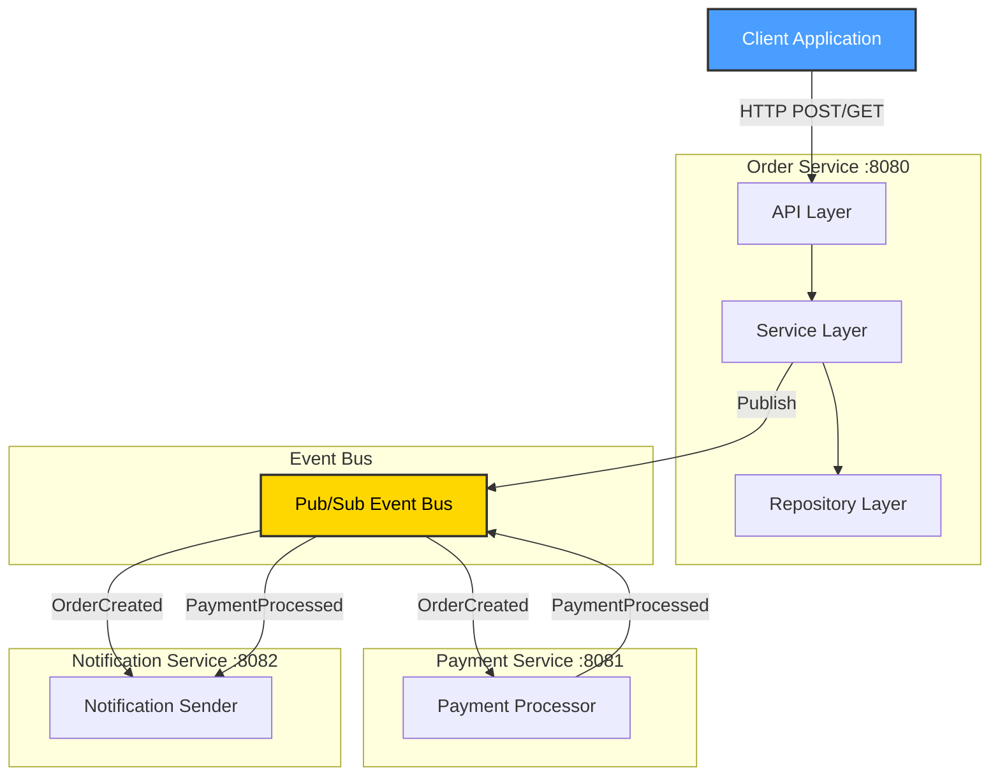
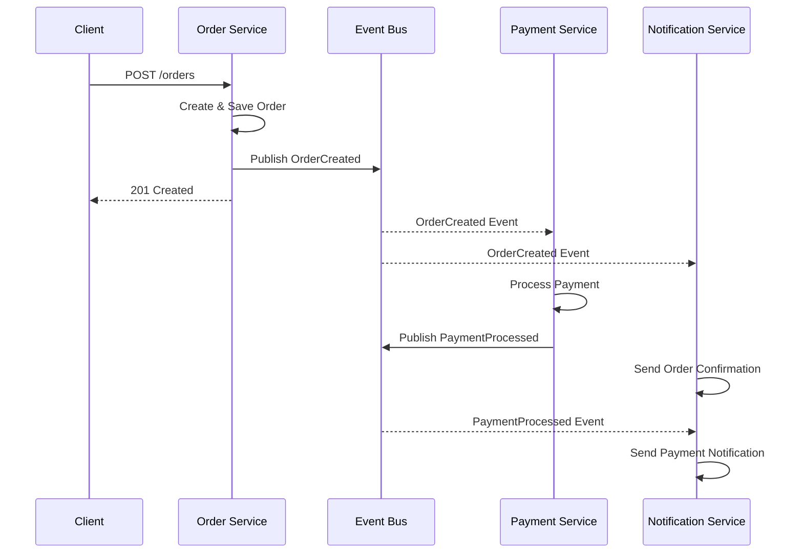
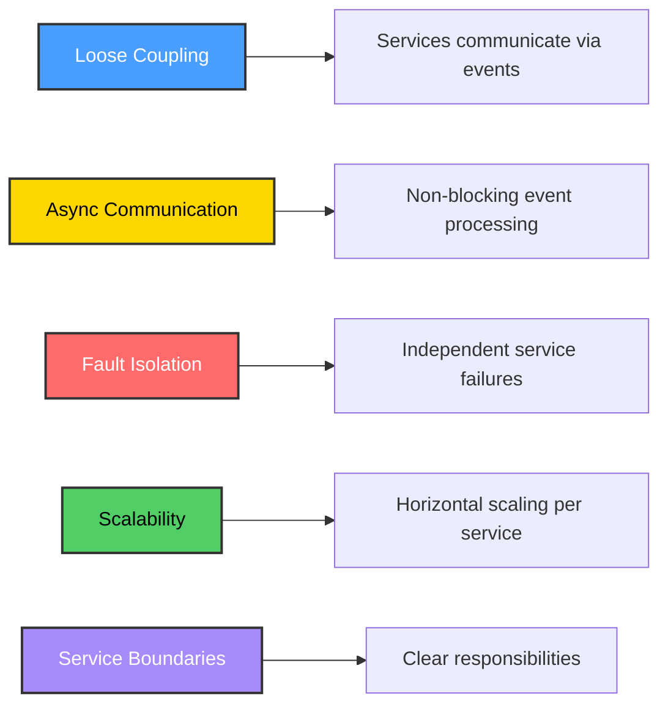
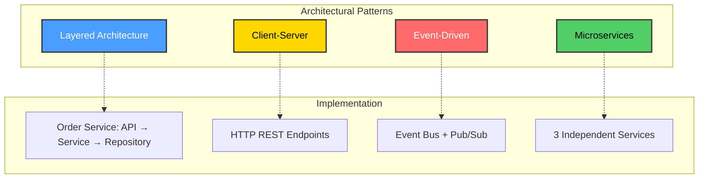
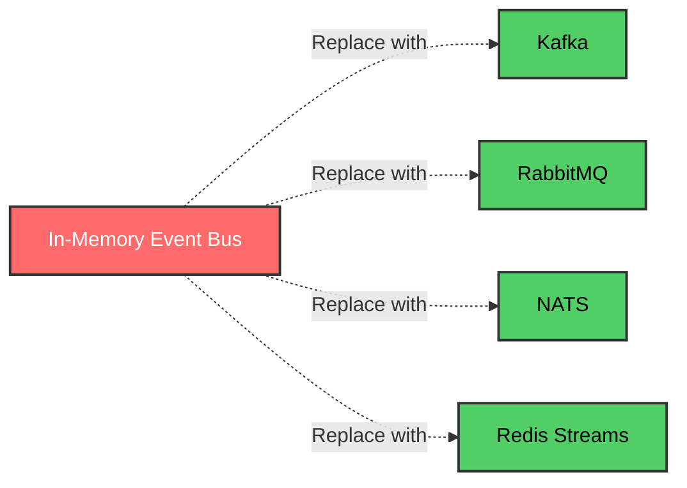
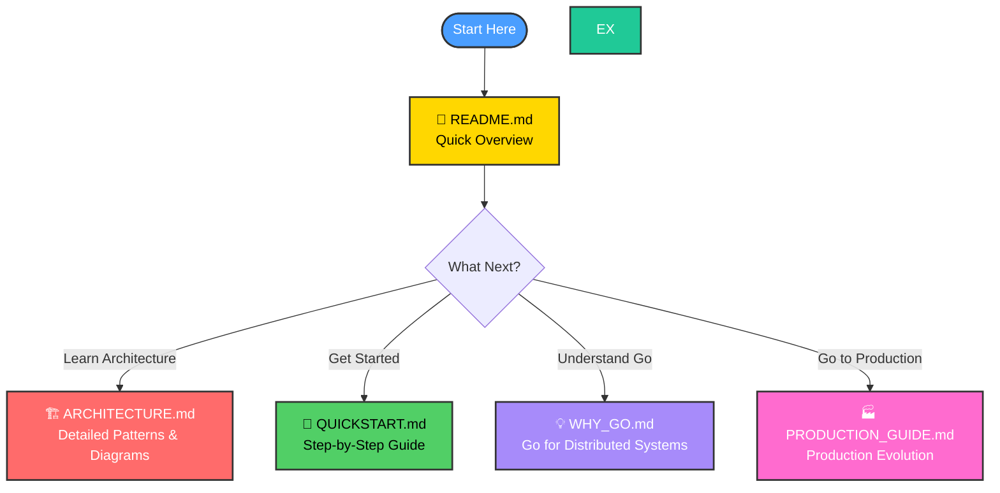

# Distributed System Demo in Go

## 🎯 Overview

This project demonstrates core distributed system architectural patterns:
- **Layered Architecture** - Clean separation of concerns (API → Service → Repository)
- **Client-Server** - HTTP-based request/response communication
- **Event-Driven Architecture** - Asynchronous event publishing and consumption
- **Microservices** - Independent, loosely-coupled services

## 📋 Table of Contents

- [Why Go for Distributed Systems?](#-why-go-for-distributed-systems)
- [Architecture](#-architecture)
- [Quick Start](#-quick-start)
- [Testing the System](#-testing-the-system)
- [Architecture Mapping](#-architecture-mapping)
- [Docker Support](#-docker-support)
- [Production Features](#-production-features)
- [Documentation](#-documentation)
- [Next Steps](#-next-steps)

## 🔧 Why Go for Distributed Systems?

Go is ideal for distributed systems because:

1. **Goroutines & Channels** - Lightweight concurrency primitives for handling thousands of concurrent connections
2. **Static Binaries** - Single executable with no runtime dependencies, perfect for containerization
3. **Fast Compilation** - Quick iteration during development
4. **Built-in HTTP Server** - Production-ready `net/http` package
5. **Strong Standard Library** - JSON, networking, and concurrency support out of the box
6. **Performance** - Near C-level performance with memory safety
7. **Simple Deployment** - No VM or interpreter needed

## 🏗️ Architecture

### System Overview



### Services

1. **Order Service** (Port 8080)
   - Layered architecture: API → Service → Repository
   - Manages order creation and retrieval
   - Publishes `OrderCreated` events

2. **Payment Service** (Port 8081)
   - Subscribes to `OrderCreated` events
   - Processes payments asynchronously
   - Publishes `PaymentProcessed` events

3. **Notification Service** (Port 8082)
   - Subscribes to `OrderCreated` and `PaymentProcessed` events
   - Sends notifications (simulated)

### Event Flow



### Distributed Concepts Demonstrated



- **Loose Coupling** - Services communicate via events, not direct calls
- **Asynchronous Communication** - Event-driven processing
- **Fault Isolation** - Each service can fail independently
- **Scalability** - Services can be scaled horizontally
- **Service Boundaries** - Clear separation of responsibilities

## 🚀 Running the System

### Prerequisites
- Go 1.21+ installed

### Start All Services

```bash
# Terminal 1 - Order Service
cd order-service
go run main.go

# Terminal 2 - Payment Service
cd payment-service
go run main.go

# Terminal 3 - Notification Service
cd notification-service
go run main.go
```

### Test the System

```bash
# Create an order
curl -X POST http://localhost:8080/orders \
  -H "Content-Type: application/json" \
  -d '{"customer_id":"cust-123","items":["item1","item2"],"total":99.99}'

# Get order by ID
curl http://localhost:8080/orders/{order-id}
```

Watch the logs in each terminal to see the event flow!

## 📊 Architecture Mapping



| Pattern | Implementation |
|---------|---------------|
| **Layered Architecture** | Order Service: API → Service → Repository layers |
| **Client-Server** | HTTP REST endpoints for synchronous communication |
| **Event-Driven** | In-memory event bus for async communication |
| **Microservices** | Three independent services with clear boundaries |

## 🐳 Docker Support (Bonus)

Each service includes a Dockerfile for containerization:

```bash
# Build and run with Docker
docker build -t order-service ./order-service
docker run -p 8080:8080 order-service
```

## 🔄 Production Features

- **Graceful Shutdown** - Services handle SIGTERM/SIGINT properly
- **Structured Logging** - Clear log output for debugging
- **Error Handling** - Proper error propagation and HTTP status codes
- **Concurrent Safety** - Thread-safe data structures (sync.RWMutex)

## 📝 Notes

This demo uses an **in-memory event bus** for simplicity. In production, you would use:



- **Kafka** - High-throughput, distributed event streaming
- **RabbitMQ** - Message queuing with routing
- **NATS** - Lightweight, cloud-native messaging
- **Redis Streams** - Simple pub/sub with persistence

The architecture principles remain the same regardless of the messaging technology.

## 📚 Documentation



| Document | Purpose |
|----------|---------|
| **[README.md](README.md)** | This file - overview and quick start |
| **[docs/ARCHITECTURE.md](docs/ARCHITECTURE.md)** | Detailed architecture with Mermaid diagrams |
| **[docs/QUICKSTART.md](docs/QUICKSTART.md)** | Step-by-step getting started guide |
| **[docs/WHY_GO.md](docs/WHY_GO.md)** | Why Go is ideal for distributed systems |
| **[docs/PRODUCTION_GUIDE.md](docs/PRODUCTION_GUIDE.md)** | Evolving to production |

## 🎓 Next Steps

1. **Run the System** - Follow the [Quick Start](#-running-the-system) above
2. **Understand Architecture** - Read [docs/ARCHITECTURE.md](docs/ARCHITECTURE.md)
4. **Explore Production** - Learn production patterns in [docs/PRODUCTION_GUIDE.md](docs/PRODUCTION_GUIDE.md)

## 🌟 Key Features

✅ **Educational but Realistic** - Production-style code, not toy examples
✅ **Clear Architecture** - Each pattern clearly demonstrated
✅ **Well Documented** - Comprehensive guides with visual diagrams
✅ **Extensible** - Easy to add new services and features
✅ **Production Ready** - Graceful shutdown, health checks, error handling

---

**Happy Learning! 🚀**

For detailed information, explore the [documentation](#-documentation) above.
