# Architecture Documentation

## System Overview

This distributed system demonstrates four key architectural patterns working together:

1. **Layered Architecture** (Order Service)
2. **Client-Server** (HTTP REST APIs)
3. **Event-Driven Architecture** (Async messaging)
4. **Microservices** (Independent services)

## High-Level Architecture Diagram

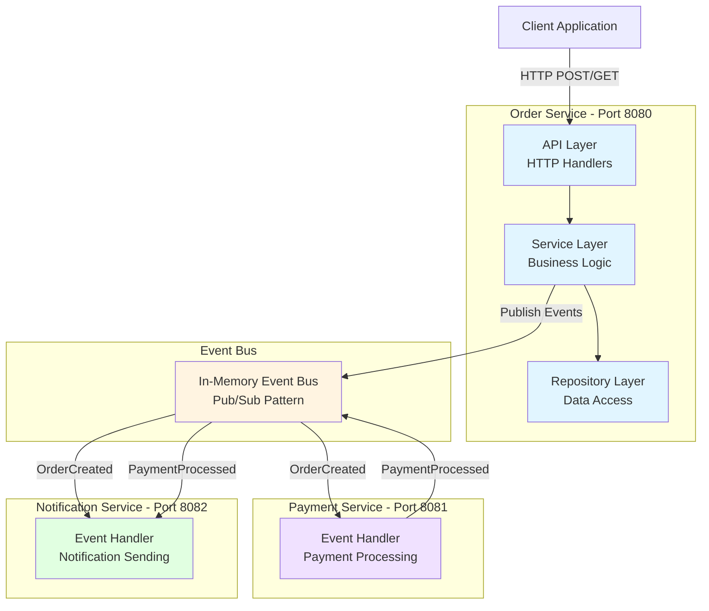

## Detailed Event Flow

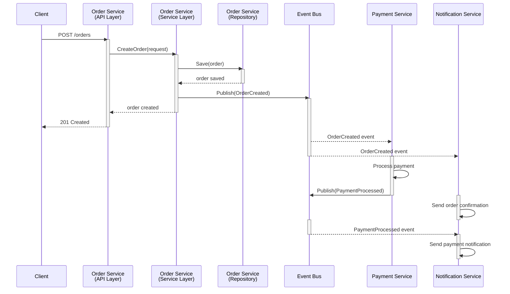

## Architecture Patterns Explained

### 1. Layered Architecture (Order Service)

The Order Service implements a classic 3-tier architecture with clear separation of concerns:

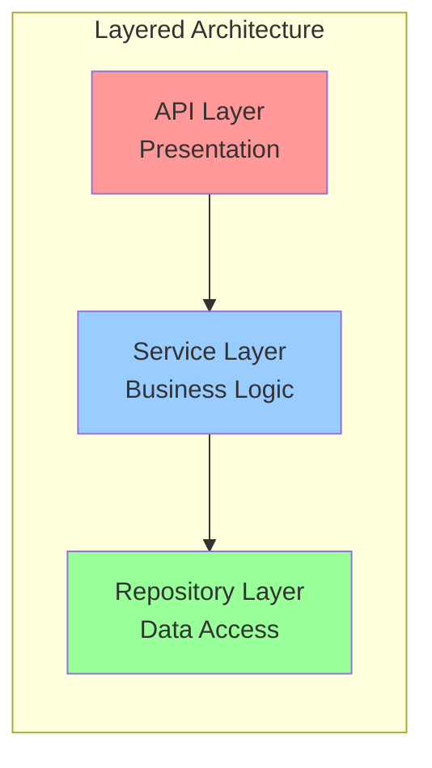

**API Layer (Presentation)**
- Handles HTTP requests/responses
- Input validation
- JSON serialization
- HTTP status codes

**Service Layer (Business Logic)**
- Order creation logic
- Event publishing
- Business rules enforcement
- Orchestration

**Repository Layer (Data Access)**
- Data persistence
- CRUD operations
- Thread-safe access
- Data retrieval

**Benefits:**
- ✅ Separation of concerns
- ✅ Easy to test each layer independently
- ✅ Clear responsibility boundaries
- ✅ Maintainable and scalable
- ✅ Can swap implementations (e.g., in-memory → PostgreSQL)

**Implementation:**
```
order-service/
├── api/handler.go          # Presentation layer
├── service/order_service.go # Business logic layer
└── repository/order_repository.go # Data access layer
```

### 2. Client-Server Pattern

Traditional request-response communication over HTTP:

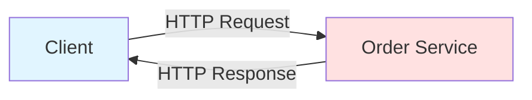

**Characteristics:**
- **Synchronous** - Client waits for response
- **Stateless** - Each request is independent
- **RESTful** - Standard HTTP methods (GET, POST, PATCH, DELETE)
- **Clear Contract** - Well-defined API endpoints

**Endpoints:**
- `POST /orders` - Create new order
- `GET /orders/{id}` - Get order by ID
- `GET /orders` - Get all orders
- `GET /health` - Health check

**Example Request/Response:**
```bash
# Request
POST /orders
Content-Type: application/json
{
  "customer_id": "cust-123",
  "items": ["laptop", "mouse"],
  "total": 1299.99
}

# Response
201 Created
{
  "id": "order-abc-123",
  "customer_id": "cust-123",
  "items": ["laptop", "mouse"],
  "total": 1299.99,
  "status": "pending"
}
```

### 3. Event-Driven Architecture

Services communicate asynchronously through events, enabling loose coupling:

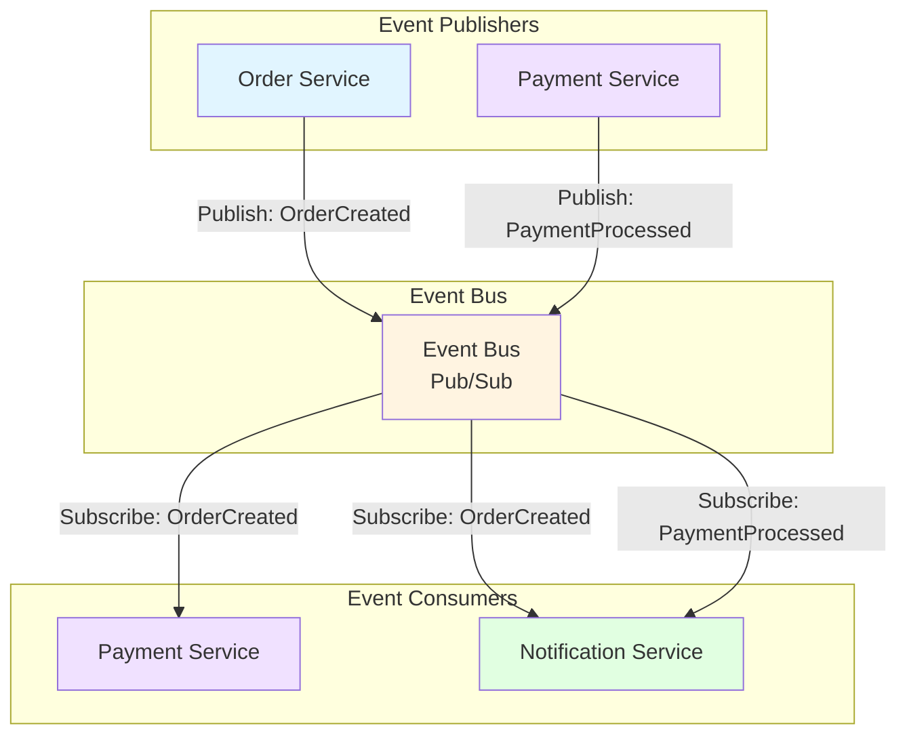

**Event Types:**

1. **OrderCreated Event**
   - Published by: Order Service
   - Consumed by: Payment Service, Notification Service
   - Payload: order_id, customer_id, items, total

2. **PaymentProcessed Event**
   - Published by: Payment Service
   - Consumed by: Notification Service
   - Payload: order_id, payment_id, amount, status

**Benefits:**
- ✅ **Loose Coupling** - Services don't know about each other
- ✅ **Asynchronous** - Non-blocking operations
- ✅ **Scalability** - Easy to add new consumers
- ✅ **Fault Tolerance** - One service failure doesn't block others
- ✅ **Flexibility** - Easy to add new event types

**Event Flow Example:**
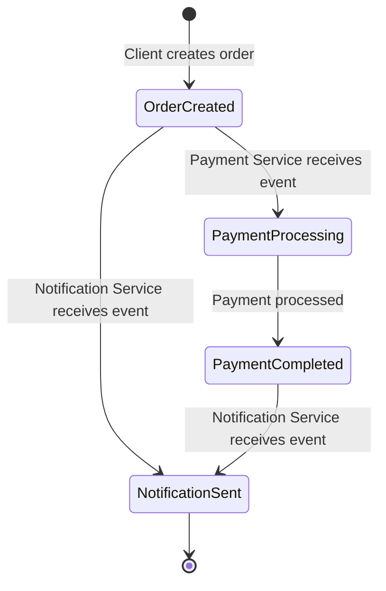

### 4. Microservices Architecture

Three independent services with clear boundaries and responsibilities:

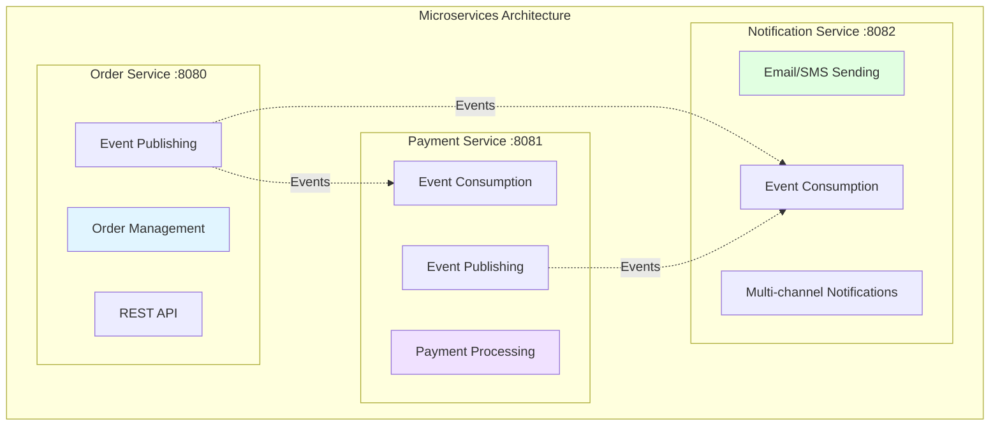

**Service Characteristics:**

| Service | Port | Responsibility | Communication | Database |
|---------|------|----------------|---------------|----------|
| **Order Service** | 8080 | Order management, CRUD operations | HTTP + Events | In-memory (orders) |
| **Payment Service** | 8081 | Payment processing, validation | Events only | None |
| **Notification Service** | 8082 | Customer notifications | Events only | None |

**Microservice Principles Demonstrated:**

1. **Single Responsibility**
   - Each service has one clear purpose
   - Order Service: Manages orders
   - Payment Service: Processes payments
   - Notification Service: Sends notifications

2. **Independent Deployment**
   - Each service can be deployed separately
   - No shared codebase (except shared events)
   - Own Docker container

3. **Technology Independence**
   - Could use different languages/frameworks
   - Could use different databases
   - Could use different deployment strategies

4. **Fault Isolation**
   - If Payment Service crashes, Order Service continues
   - If Notification Service is down, payments still process
   - Each service has its own lifecycle

5. **Independent Scaling**
   - Scale Order Service for high order volume
   - Scale Payment Service for payment processing
   - Scale Notification Service for notification load

## Distributed System Concepts

### 1. Loose Coupling

Services are independent and communicate through well-defined interfaces:

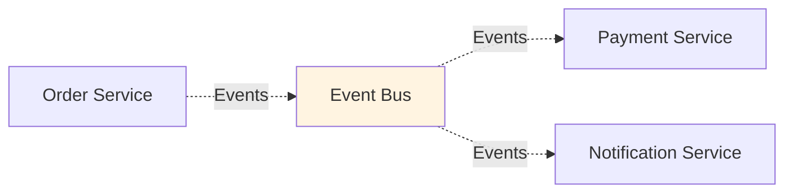

**How it's achieved:**
- Services don't call each other directly
- Communication through events
- No shared database
- Services can be added/removed without affecting others

**Benefits:**
- Easy to modify one service without affecting others
- Easy to add new services
- Easy to replace implementations

### 2. Asynchronous Communication

Events are processed asynchronously without blocking:

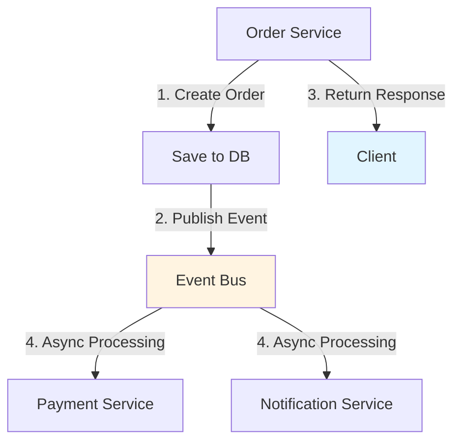

**Key Points:**
- Order creation returns immediately
- Payment processing happens in background
- Client doesn't wait for payment
- Non-blocking operations

### 3. Fault Isolation

Services fail independently without cascading failures:

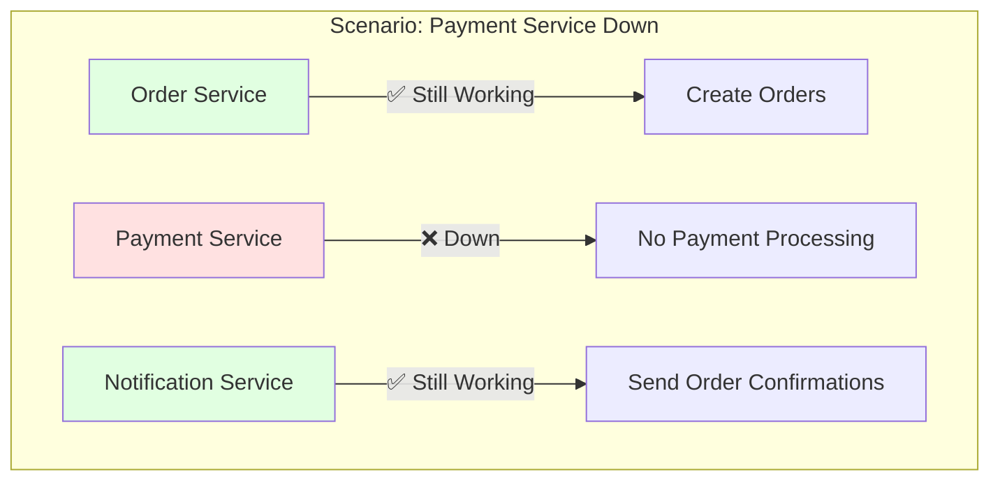

**Isolation Mechanisms:**
- Separate processes
- Independent lifecycles
- No shared state
- Event-driven communication

### 4. Scalability

Services can scale independently based on load:

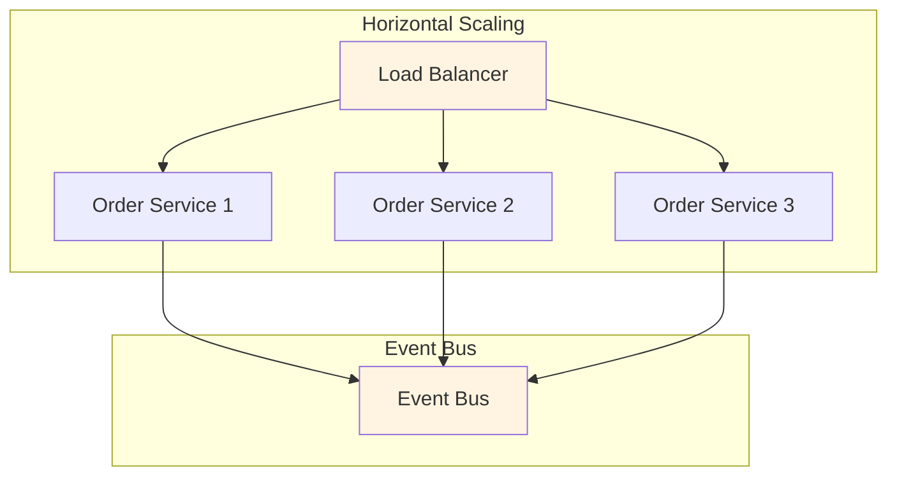

**Scaling Strategies:**
- **Horizontal**: Add more instances
- **Vertical**: Increase resources per instance
- **Independent**: Scale each service based on its needs

## Go-Specific Features

### Goroutines for Concurrency

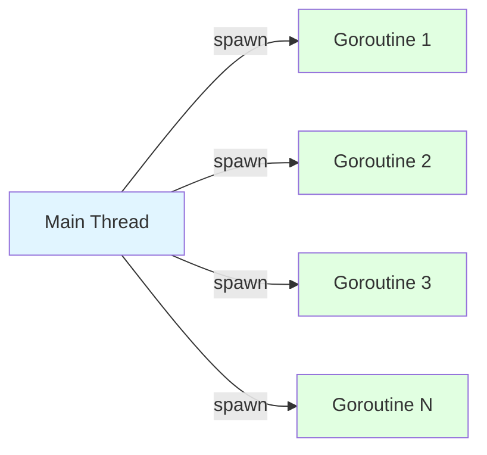

**Implementation:**
```go
// Event handlers run in separate goroutines
for _, handler := range handlers {
    go func(h Handler) {
        h(event)  // Non-blocking!
    }(handler)
}
```

**Benefits:**
- Lightweight (2KB stack vs 1MB thread)
- Can handle thousands of concurrent events
- Built-in scheduler
- No manual thread management

### Channels for Communication

```go
// Safe communication between goroutines
events := make(chan Event, 100)

// Producer
go func() {
    events <- newEvent
}()

// Consumer
go func() {
    event := <-events
    process(event)
}()
```

**Benefits:**
- No race conditions
- No shared memory issues
- Clear data flow
- Type-safe

### sync.RWMutex for Thread Safety

```go
type OrderRepository struct {
    orders map[string]*Order
    mu     sync.RWMutex  // Concurrent safety
}

func (r *OrderRepository) Save(order *Order) error {
    r.mu.Lock()         // Exclusive write lock
    defer r.mu.Unlock()
    r.orders[order.ID] = order
    return nil
}

func (r *OrderRepository) FindByID(id string) (*Order, error) {
    r.mu.RLock()        // Shared read lock
    defer r.mu.RUnlock()
    return r.orders[id], nil
}
```

**Benefits:**
- Multiple readers, single writer
- Prevents race conditions
- Efficient concurrent access

## Production Considerations

### What's Simplified (Demo)

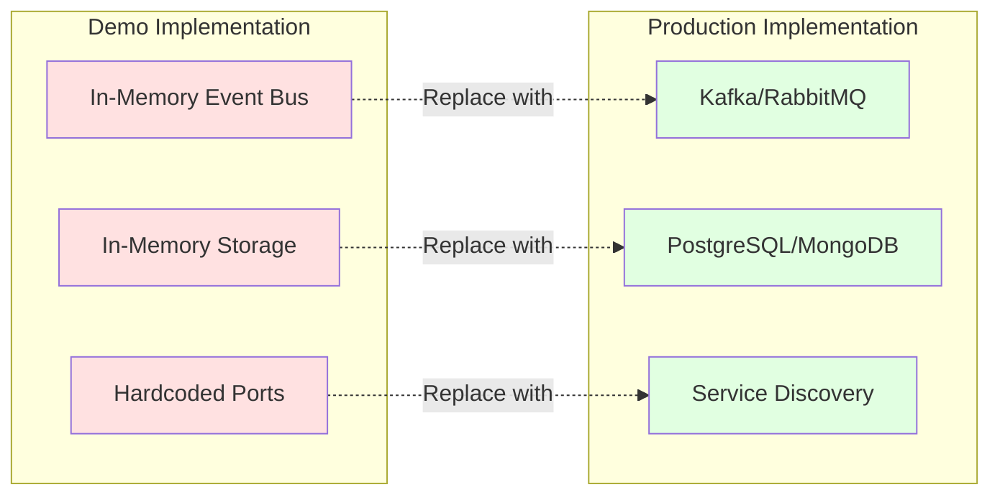

### What's Production-Ready

✅ **Graceful Shutdown** - Proper signal handling
✅ **Structured Logging** - Clear log messages
✅ **Error Handling** - Proper error propagation
✅ **HTTP Timeouts** - Read/Write/Idle timeouts
✅ **Concurrent Safety** - Thread-safe data structures
✅ **Health Checks** - `/health` endpoints
✅ **Dockerization** - Multi-stage builds

## System Behavior Examples

### Success Flow

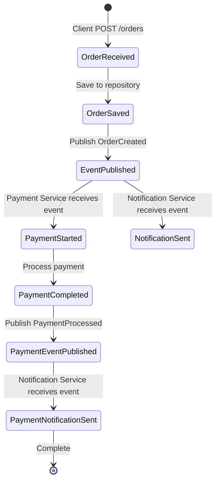

### Failure Handling

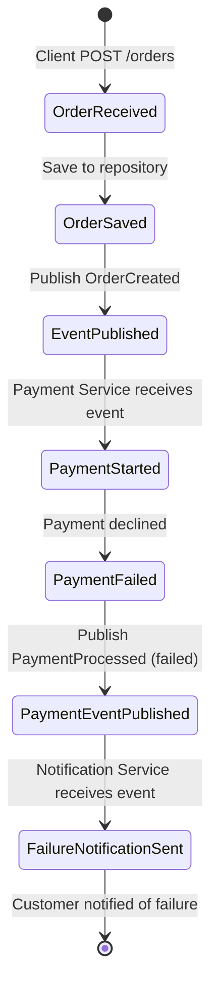

## Extending the System

### Adding a New Service

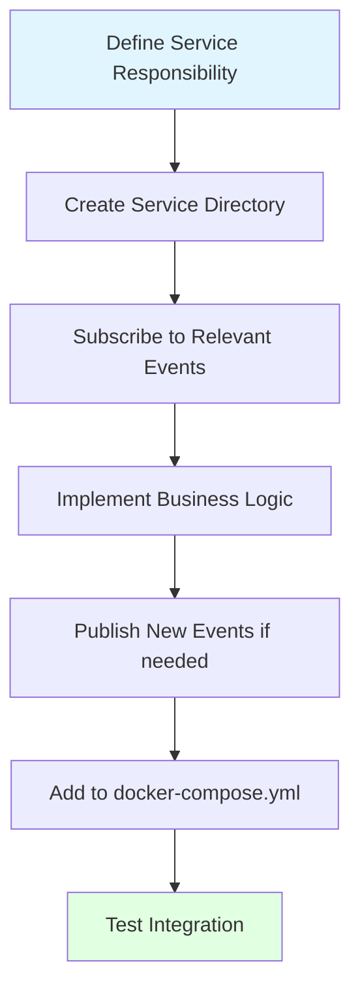

### Adding a New Event Type

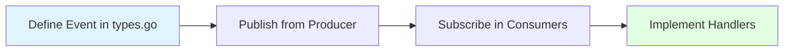

## Conclusion

This system demonstrates how distributed system patterns work together:

- **Layered Architecture** provides structure within services
- **Client-Server** enables synchronous communication
- **Event-Driven** enables asynchronous communication
- **Microservices** enables independent scaling and deployment

The implementation is educational but follows production best practices, making it a solid foundation for understanding distributed systems.
