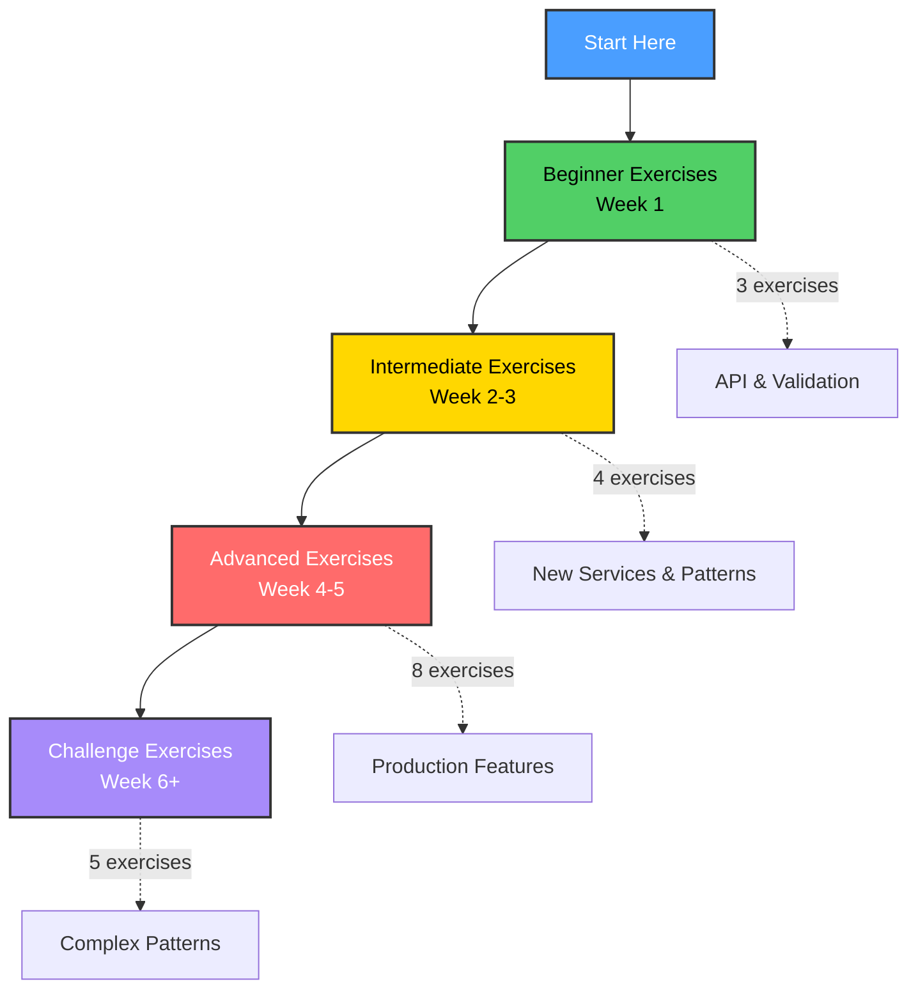
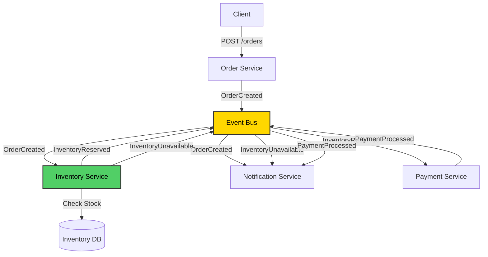
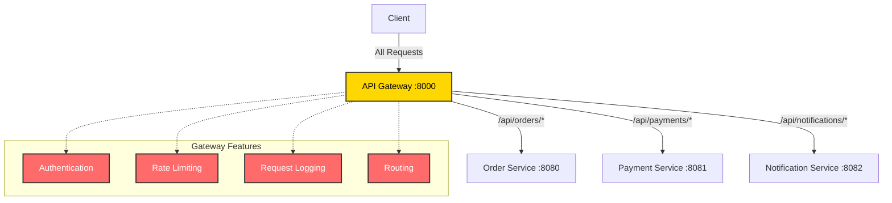
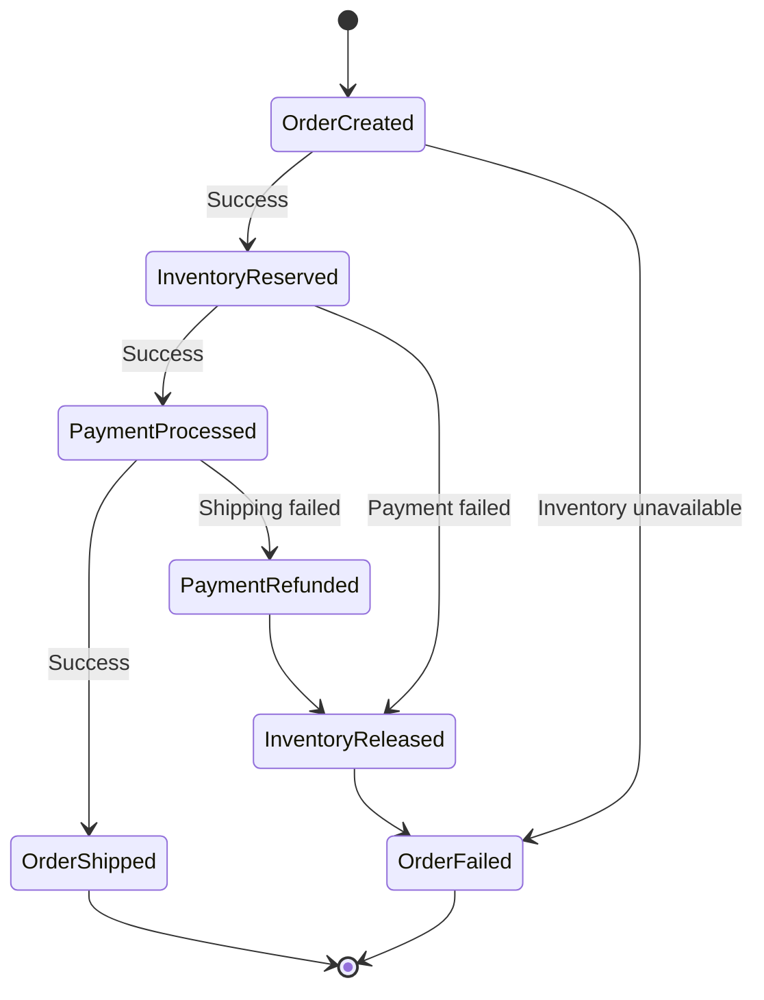
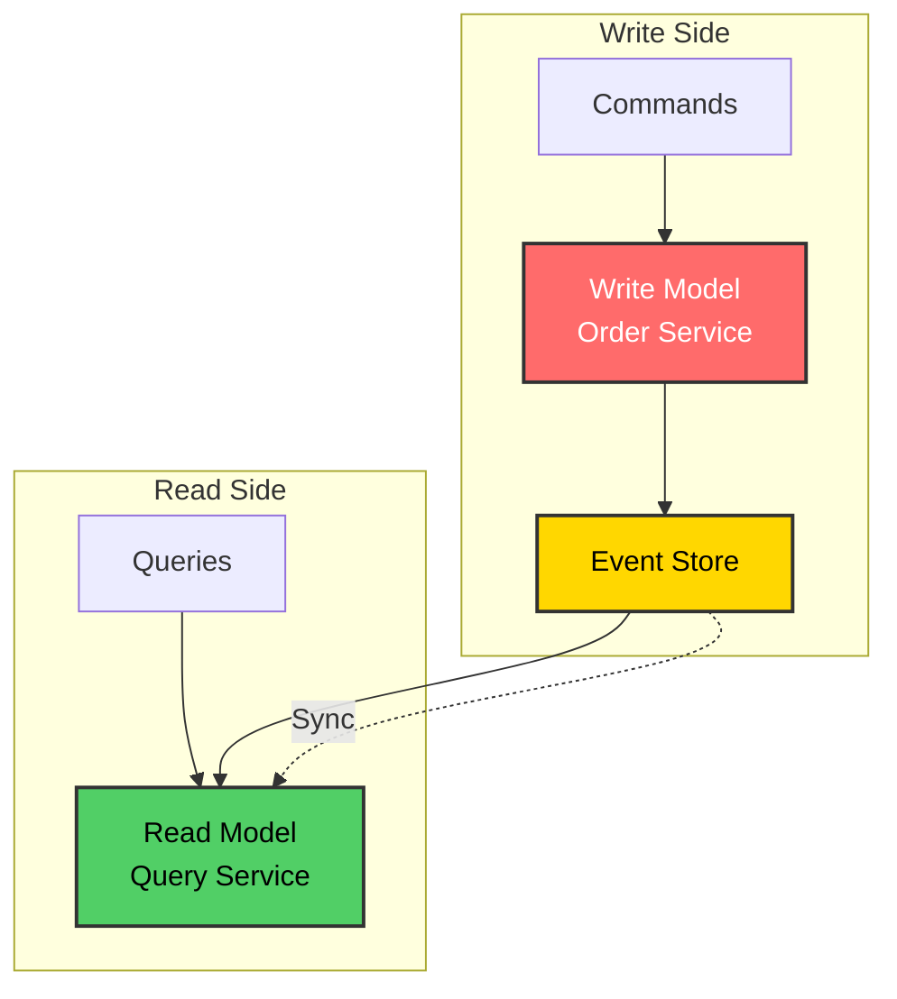

# Learning Exercises

## Learning Path Overview



## Difficulty Levels

| Level | Exercises | Time | Focus |
|-------|-----------|------|-------|
| 🟢 **Beginner** | 1-3 | 1-2 hours each | API design, validation, middleware |
| 🟡 **Intermediate** | 4-7 | 3-5 hours each | New services, patterns, tracking |
| 🔴 **Advanced** | 8-15 | 5-10 hours each | Production features, databases, monitoring |
| ⚫ **Challenge** | 16-18 | 10+ hours each | Complex patterns, distributed transactions |

## Beginner Exercises

### Exercise 1: Add Order Status Endpoint

**Goal:** Add an endpoint to update order status

**Tasks:**
1. Add `UpdateStatus(orderID, status string)` method to OrderService
2. Add `PATCH /orders/{id}/status` endpoint
3. Test with curl

**Expected Result:**
```bash
curl -X PATCH http://localhost:8080/orders/{id}/status \
  -H "Content-Type: application/json" \
  -d '{"status":"completed"}'
```

**Learning:** REST API design, HTTP methods

---

### Exercise 2: Add Order Validation

**Goal:** Validate order data before creation

**Tasks:**
1. Add validation in CreateOrder handler
2. Check: customer_id not empty, items not empty, total > 0
3. Return 400 Bad Request with error message

**Test Cases:**
- Empty customer_id → 400
- Empty items → 400
- Negative total → 400
- Valid order → 201

**Learning:** Input validation, error handling

---

### Exercise 3: Add Logging Middleware

**Goal:** Log all HTTP requests

**Tasks:**
1. Create middleware function
2. Log: method, path, status code, duration
3. Apply to all routes

**Expected Output:**
```
[2024-12-25 10:30:45] POST /orders 201 45ms
[2024-12-25 10:30:50] GET /orders/abc-123 200 2ms
```

**Learning:** Middleware pattern, HTTP interceptors

---

## Intermediate Exercises

### Exercise 4: Add Inventory Service

**Goal:** Create a new microservice to manage inventory

**Architecture:**


**Tasks:**
1. Create `inventory-service/` directory
2. Subscribe to `OrderCreated` events
3. Check if items are in stock
4. Publish `InventoryReserved` or `InventoryUnavailable` events
5. Update Order Service to handle inventory events

**Event Flow:**
```
Order Created → Inventory Service → Check Stock
                     ↓
              InventoryReserved → Payment Service
                     ↓
              InventoryUnavailable → Notification Service
```

**Learning:** Adding new services, event-driven workflows

---

### Exercise 5: Add Request ID Tracking

**Goal:** Track requests across services

**Tasks:**
1. Generate unique request ID in Order Service
2. Pass request ID in events
3. Log request ID in all services
4. Add request ID to HTTP responses

**Expected Log:**
```
[req-123] Order Service: Creating order
[req-123] Payment Service: Processing payment
[req-123] Notification Service: Sending notification
```

**Learning:** Distributed tracing basics, correlation IDs

---

### Exercise 6: Add Retry Logic

**Goal:** Retry failed operations

**Tasks:**
1. Simulate payment failures (random)
2. Add retry logic with exponential backoff
3. Max 3 retries
4. Log each retry attempt

**Implementation:**
```go
func retryWithBackoff(fn func() error, maxRetries int) error {
    for i := 0; i < maxRetries; i++ {
        err := fn()
        if err == nil {
            return nil
        }
        time.Sleep(time.Duration(math.Pow(2, float64(i))) * time.Second)
    }
    return errors.New("max retries exceeded")
}
```

**Learning:** Resilience patterns, error handling

---

### Exercise 7: Add Health Check Details

**Goal:** Enhance health check endpoint

**Tasks:**
1. Check database connection
2. Check event bus connection
3. Return detailed status

**Response:**
```json
{
  "status": "healthy",
  "checks": {
    "database": "ok",
    "event_bus": "ok"
  },
  "uptime": "2h30m",
  "version": "1.0.0"
}
```

**Learning:** Health checks, monitoring

---

## Advanced Exercises

### Exercise 8: Replace Event Bus with Kafka

**Goal:** Use real message broker

**Tasks:**
1. Install Kafka with Docker
2. Replace in-memory event bus with Kafka
3. Use `segmentio/kafka-go` library
4. Create topics for each event type
5. Implement consumer groups

**Docker Compose:**
```yaml
services:
  kafka:
    image: confluentinc/cp-kafka:latest
    ports:
      - "9092:9092"
```

**Learning:** Message brokers, Kafka basics

---

### Exercise 9: Add PostgreSQL Database

**Goal:** Replace in-memory storage with real database

**Tasks:**
1. Install PostgreSQL with Docker
2. Create orders table
3. Implement PostgresOrderRepository
4. Use `lib/pq` or `pgx` driver
5. Add database migrations

**Schema:**
```sql
CREATE TABLE orders (
    id UUID PRIMARY KEY,
    customer_id VARCHAR(255),
    items TEXT[],
    total DECIMAL(10,2),
    status VARCHAR(50),
    created_at TIMESTAMP DEFAULT NOW()
);
```

**Learning:** Database integration, SQL

---

### Exercise 10: Add API Gateway

**Goal:** Single entry point for all services

**Architecture:**


**Tasks:**
1. Create `api-gateway/` service
2. Route `/api/orders/*` to Order Service
3. Add authentication middleware
4. Add rate limiting
5. Add request/response logging

**Learning:** API Gateway pattern, reverse proxy

---

### Exercise 11: Add Circuit Breaker

**Goal:** Prevent cascading failures

**Tasks:**
1. Install `github.com/sony/gobreaker`
2. Wrap Payment Service calls with circuit breaker
3. Configure: 5 failures → open circuit for 30s
4. Return fallback response when circuit is open

**States:**
- Closed: Normal operation
- Open: Reject requests immediately
- Half-Open: Test if service recovered

**Learning:** Resilience patterns, fault tolerance

---

### Exercise 12: Add Prometheus Metrics

**Goal:** Expose metrics for monitoring

**Tasks:**
1. Install `prometheus/client_golang`
2. Add metrics:
   - `orders_created_total` (counter)
   - `order_duration_seconds` (histogram)
   - `active_orders` (gauge)
3. Expose `/metrics` endpoint
4. Run Prometheus and Grafana

**Metrics Example:**
```
# HELP orders_created_total Total orders created
# TYPE orders_created_total counter
orders_created_total 1234

# HELP order_duration_seconds Order processing duration
# TYPE order_duration_seconds histogram
order_duration_seconds_bucket{le="0.1"} 100
order_duration_seconds_bucket{le="0.5"} 450
```

**Learning:** Observability, metrics

---

### Exercise 13: Add Distributed Tracing

**Goal:** Trace requests across services

**Tasks:**
1. Install Jaeger
2. Add OpenTracing instrumentation
3. Create spans for each operation
4. Propagate trace context in events
5. View traces in Jaeger UI

**Trace Example:**
```
Trace: Create Order (100ms)
  ├─ HTTP POST /orders (5ms)
  ├─ Save to DB (10ms)
  ├─ Publish Event (2ms)
  └─ Process Payment (80ms)
      ├─ Validate Payment (20ms)
      └─ Charge Card (60ms)
```

**Learning:** Distributed tracing, observability

---

### Exercise 14: Add Authentication

**Goal:** Secure the API with JWT

**Tasks:**
1. Create auth service
2. Implement login endpoint
3. Generate JWT tokens
4. Add authentication middleware
5. Validate tokens on protected endpoints

**Flow:**
```
1. POST /auth/login → JWT token
2. POST /orders (with token) → Create order
3. GET /orders (with token) → Get orders
```

**Learning:** Authentication, JWT, security

---

### Exercise 15: Deploy to Kubernetes

**Goal:** Run system in Kubernetes

**Tasks:**
1. Create Deployment manifests for each service
2. Create Service manifests
3. Add ConfigMaps for configuration
4. Add Secrets for sensitive data
5. Deploy to local Kubernetes (minikube)

**Manifests:**
- `k8s/order-service-deployment.yaml`
- `k8s/order-service-service.yaml`
- `k8s/configmap.yaml`
- `k8s/secrets.yaml`

**Learning:** Kubernetes, container orchestration

---

## Challenge Exercises

### Challenge 1: Saga Pattern

**Goal:** Implement distributed transaction

**Scenario:** Order → Reserve Inventory → Process Payment → Ship Order



**Tasks:**
1. Implement saga coordinator
2. Handle compensation (rollback) on failure
3. If payment fails → release inventory
4. If shipping fails → refund payment

**Learning:** Distributed transactions, saga pattern

---

### Challenge 2: CQRS Pattern

**Goal:** Separate read and write models



**Tasks:**
1. Create write model (commands)
2. Create read model (queries)
3. Use events to sync models
4. Optimize read model for queries

**Learning:** CQRS, event sourcing

---

### Challenge 3: Event Sourcing

**Goal:** Store events instead of state

**Tasks:**
1. Store all events in event store
2. Rebuild state by replaying events
3. Add snapshots for performance
4. Implement time travel (view past state)

**Events:**
- OrderCreated
- OrderUpdated
- PaymentProcessed
- OrderShipped

**Learning:** Event sourcing, audit trail

---

### Challenge 4: Multi-Region Deployment

**Goal:** Deploy across multiple regions

**Tasks:**
1. Deploy to 3 regions (US, EU, Asia)
2. Implement geo-routing
3. Handle data replication
4. Ensure eventual consistency

**Learning:** Global distribution, CAP theorem

---

### Challenge 5: Chaos Engineering

**Goal:** Test system resilience

**Tasks:**
1. Randomly kill services
2. Inject network latency
3. Simulate database failures
4. Verify system continues working

**Tools:**
- Chaos Monkey
- Toxiproxy
- Pumba

**Learning:** Resilience testing, chaos engineering

---

## Testing Exercises

### Exercise 16: Unit Tests

**Goal:** Test business logic

**Tasks:**
1. Write tests for OrderService
2. Mock repository
3. Test success and error cases
4. Achieve 80%+ coverage

**Example:**
```go
func TestCreateOrder(t *testing.T) {
    repo := &MockRepository{}
    service := NewOrderService(repo, eventBus)
    
    order, err := service.CreateOrder(validRequest)
    
    assert.NoError(t, err)
    assert.NotEmpty(t, order.ID)
}
```

---

### Exercise 17: Integration Tests

**Goal:** Test service interactions

**Tasks:**
1. Start all services
2. Create order via HTTP
3. Verify events are published
4. Verify all services processed events

**Learning:** Integration testing, end-to-end testing

---

### Exercise 18: Load Testing

**Goal:** Test system under load

**Tasks:**
1. Install `hey` or `wrk`
2. Send 10,000 requests
3. Measure throughput and latency
4. Identify bottlenecks

**Command:**
```bash
hey -n 10000 -c 100 -m POST \
  -H "Content-Type: application/json" \
  -d '{"customer_id":"test","items":["item1"],"total":99.99}' \
  http://localhost:8080/orders
```

**Learning:** Performance testing, benchmarking

---

## Bonus: Real-World Scenarios

### Scenario 1: Black Friday Sale

**Challenge:** Handle 100x normal traffic

**Tasks:**
1. Implement rate limiting
2. Add caching
3. Scale services horizontally
4. Use queue for order processing

---

### Scenario 2: Payment Provider Outage

**Challenge:** Payment service is down

**Tasks:**
1. Implement circuit breaker
2. Queue orders for later processing
3. Notify customers of delay
4. Retry when service recovers

---

### Scenario 3: Data Migration

**Challenge:** Migrate from in-memory to PostgreSQL

**Tasks:**
1. Implement dual-write (both stores)
2. Migrate existing data
3. Verify data consistency
4. Switch to PostgreSQL only

---

## Learning Path

**Week 1:** Beginner exercises (1-3)
**Week 2:** Intermediate exercises (4-7)
**Week 3:** Advanced exercises (8-12)
**Week 4:** Advanced exercises (13-15)
**Week 5:** Challenge exercises (1-3)
**Week 6:** Testing exercises (16-18)

## Resources

- [Go Documentation](https://go.dev/doc/)
- [Microservices Patterns](https://microservices.io/patterns/)
- [Distributed Systems Course](https://www.distributedsystemscourse.com/)
- [System Design Primer](https://github.com/donnemartin/system-design-primer)

Good luck! 🚀
