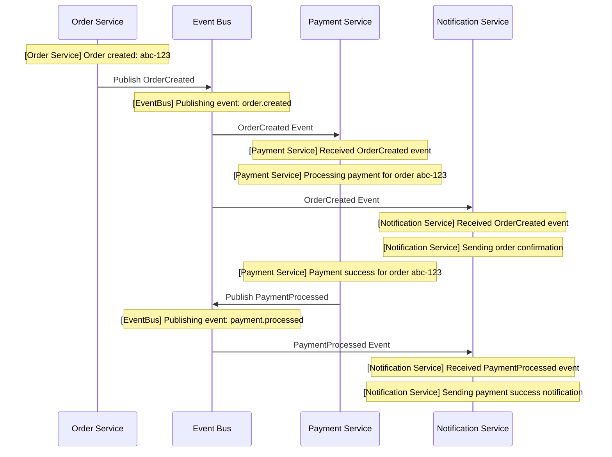

# Quick Start Guide

## Overview


## Prerequisites

- Go 1.21 or higher
- curl (for testing)
- Docker (optional, for containerized deployment)

## Option 1: Run Locally (Recommended for Development)

### Step 1: Install Dependencies

```bash
# Install dependencies for each service
cd order-service && go mod download && cd ..
cd payment-service && go mod download && cd ..
cd notification-service && go mod download && cd ..
```

### Step 2: Start Services

**On Linux/Mac:**
```bash
chmod +x run-all.sh
./run-all.sh
```

**On Windows:**
```cmd
run-all.bat
```

**Or manually in separate terminals:**

```bash
# Terminal 1
cd order-service
go run main.go

# Terminal 2
cd payment-service
go run main.go

# Terminal 3
cd notification-service
go run main.go
```

### Step 3: Test the System

**On Linux/Mac:**
```bash
chmod +x test-system.sh
./test-system.sh
```

**On Windows:**
```cmd
test-system.bat
```

**Or manually:**

```bash
# Create an order
curl -X POST http://localhost:8080/orders \
  -H "Content-Type: application/json" \
  -d '{
    "customer_id": "cust-123",
    "items": ["laptop", "mouse"],
    "total": 1299.99
  }'

# Get all orders
curl http://localhost:8080/orders

# Get specific order (replace {id} with actual order ID)
curl http://localhost:8080/orders/{id}
```

### Step 4: Watch the Logs

You'll see the event flow across services:



**Console Output:**
```
[Order Service] Order created: abc-123
[EventBus] Publishing event: order.created
[Payment Service] Received OrderCreated event
[Notification Service] Received OrderCreated event
[Payment Service] Processing payment for order abc-123
[Notification Service] Sending order confirmation
[Payment Service] Payment success for order abc-123
[EventBus] Publishing event: payment.processed
[Notification Service] Received PaymentProcessed event
[Notification Service] Sending payment success notification
```

## Option 2: Run with Docker

### Step 1: Build and Start

```bash
docker-compose up --build
```

### Step 2: Test

```bash
curl -X POST http://localhost:8080/orders \
  -H "Content-Type: application/json" \
  -d '{
    "customer_id": "cust-123",
    "items": ["laptop"],
    "total": 999.99
  }'
```

### Step 3: View Logs

```bash
# All services
docker-compose logs -f

# Specific service
docker-compose logs -f order-service
docker-compose logs -f payment-service
docker-compose logs -f notification-service
```

### Step 4: Stop

```bash
docker-compose down
```

## API Reference

### Order Service (Port 8080)

#### Create Order
```bash
POST /orders
Content-Type: application/json

{
  "customer_id": "string",
  "items": ["string"],
  "total": number
}

Response: 201 Created
{
  "id": "string",
  "customer_id": "string",
  "items": ["string"],
  "total": number,
  "status": "pending"
}
```

#### Get Order
```bash
GET /orders/{id}

Response: 200 OK
{
  "id": "string",
  "customer_id": "string",
  "items": ["string"],
  "total": number,
  "status": "pending"
}
```

#### Get All Orders
```bash
GET /orders

Response: 200 OK
[
  {
    "id": "string",
    "customer_id": "string",
    "items": ["string"],
    "total": number,
    "status": "pending"
  }
]
```

#### Health Check
```bash
GET /health

Response: 200 OK
```

### Payment Service (Port 8081)

- No HTTP endpoints (event-driven only)
- Health check: `GET /health`

### Notification Service (Port 8082)

- No HTTP endpoints (event-driven only)
- Health check: `GET /health`

## Troubleshooting

### Port Already in Use

**Linux/Mac:**
```bash
# Find process using port
lsof -i :8080
lsof -i :8081
lsof -i :8082

# Kill process
kill -9 <PID>
```

**Windows:**
```cmd
# Find process using port
netstat -ano | findstr :8080

# Kill process
taskkill /PID <PID> /F
```

### Module Not Found

```bash
# Clean and reinstall dependencies
cd order-service
go clean -modcache
go mod download
```

### Services Not Communicating

- Ensure all services are running
- Check logs for errors
- Verify ports are not blocked by firewall
- In Docker, ensure services are on same network

## Next Steps

1. Read [ARCHITECTURE.md](ARCHITECTURE.md) for detailed architecture explanation
2. Explore the code to understand implementation
3. Try modifying the system:
   - Add a new event type
   - Create a new service
   - Add database persistence
   - Implement retry logic
4. Replace in-memory event bus with Kafka or RabbitMQ

## Learning Exercises

1. **Add Inventory Service**
   - Subscribe to OrderCreated
   - Check inventory availability
   - Publish InventoryReserved event

2. **Add API Gateway**
   - Single entry point for all services
   - Request routing
   - Authentication

3. **Add Database**
   - Replace in-memory repository with PostgreSQL
   - Use GORM or sqlx

4. **Add Monitoring**
   - Prometheus metrics
   - Grafana dashboards
   - Distributed tracing with Jaeger

5. **Add Resilience**
   - Circuit breaker pattern
   - Retry with exponential backoff
   - Timeout handling

Happy coding! 🚀
