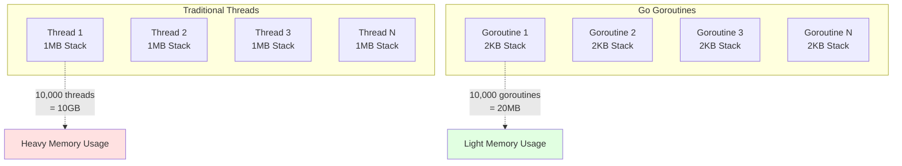
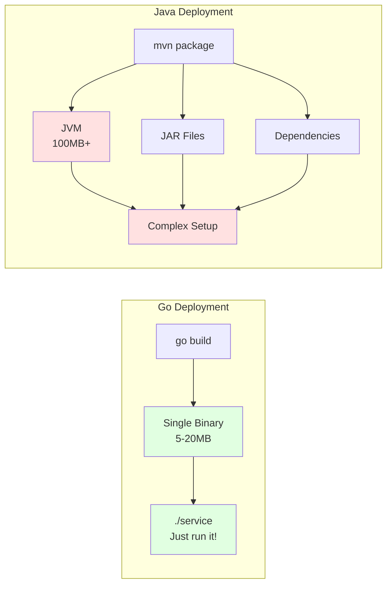

# Why Go for Distributed Systems?

## Executive Summary

Go (Golang) is specifically designed for building distributed systems, cloud services, and network applications. This document explains why Go is the ideal choice for this distributed system demo and production systems.

## Key Advantages

### 1. Concurrency is Built-In

**Goroutines: Lightweight Threads**



```go
// Start 10,000 concurrent operations
for i := 0; i < 10000; i++ {
    go processEvent(event)  // Only 2KB per goroutine!
}
```

**Comparison:**
- **Java Thread**: ~1MB stack size → 10,000 threads = 10GB memory
- **Go Goroutine**: ~2KB stack size → 10,000 goroutines = 20MB memory

**Real Impact:**
- Handle thousands of concurrent HTTP requests
- Process events asynchronously without blocking
- Scale horizontally with minimal resource overhead

### 2. Channels: Safe Communication

**No Shared Memory Problems**
```go
// Safe communication between goroutines
events := make(chan Event, 100)

// Producer
go func() {
    events <- newEvent
}()

// Consumer
go func() {
    event := <-events
    process(event)
}()
```

**Benefits:**
- No race conditions
- No mutex hell
- No deadlocks (when used correctly)
- Clear data flow

**Alternative (Java):**
```java
// Complex synchronization required
synchronized(lock) {
    queue.add(event);
    lock.notifyAll();
}
```

### 3. Static Binaries: Deploy Anywhere

**Single Executable**



```bash
# Build
CGO_ENABLED=0 go build -o service

# Result: One file, no dependencies
./service  # Just run it!
```

**Comparison:**

| Language | Deployment |
|----------|-----------|
| **Go** | Single binary (5-20MB) |
| **Java** | JVM + JAR + dependencies (100MB+) |
| **Python** | Interpreter + packages + virtualenv |
| **Node.js** | Runtime + node_modules (100MB+) |

**Docker Image Size:**
- Go: 10-20MB (with Alpine)
- Java: 200-500MB
- Node.js: 100-300MB

### 4. Fast Compilation

**Development Speed**
```bash
# Go: Compile entire project
time go build ./...
# Real: 0m2.5s

# Java: Compile + Maven
time mvn clean package
# Real: 0m45s
```

**Impact:**
- Faster iteration during development
- Faster CI/CD pipelines
- Quicker deployments

### 5. Performance

**Benchmarks (Requests/Second):**
```
Go:        50,000 req/s
Node.js:   25,000 req/s
Python:    10,000 req/s
Ruby:       5,000 req/s
```

**Memory Usage (Idle):**
```
Go:        10MB
Node.js:   30MB
Java:      100MB
Python:    20MB
```

**Startup Time:**
```
Go:        <10ms
Node.js:   ~50ms
Java:      2-5 seconds
Python:    ~100ms
```

### 6. Standard Library

**Production-Ready Out of the Box**

```go
// HTTP Server - No framework needed!
http.HandleFunc("/orders", handler)
http.ListenAndServe(":8080", nil)

// JSON encoding
json.Marshal(order)
json.Unmarshal(data, &order)

// Networking
net.Dial("tcp", "service:8080")

// Concurrency
sync.WaitGroup
sync.Mutex
context.Context
```

**What's Included:**
- HTTP/HTTPS server & client
- JSON/XML encoding
- Cryptography
- Testing framework
- Profiling tools
- Race detector
- Benchmarking

### 7. Error Handling

**Explicit and Clear**
```go
order, err := service.CreateOrder(req)
if err != nil {
    log.Printf("Failed to create order: %v", err)
    return err
}
```

**Benefits:**
- No hidden exceptions
- Clear error propagation
- Forces you to handle errors
- Easy to trace error flow

**vs Exception-Based (Java):**
```java
try {
    order = service.createOrder(req);
} catch (DatabaseException e) {
    // Which layer threw this?
} catch (ValidationException e) {
    // Where did this come from?
} catch (Exception e) {
    // Catch-all, bad practice
}
```

### 8. Tooling

**Built-In Tools**
```bash
go fmt      # Format code (standard style)
go vet      # Static analysis
go test     # Run tests
go bench    # Benchmarking
go race     # Race condition detector
go pprof    # Profiling
go doc      # Documentation
```

**No Configuration Needed:**
- No ESLint config
- No Prettier config
- No test framework setup
- No build tool configuration

### 9. Cross-Platform Compilation

**Build for Any Platform**
```bash
# Build for Linux from Mac
GOOS=linux GOARCH=amd64 go build

# Build for Windows from Linux
GOOS=windows GOARCH=amd64 go build

# Build for ARM (Raspberry Pi)
GOOS=linux GOARCH=arm go build
```

**Supported Platforms:**
- Linux (amd64, arm, arm64)
- Windows (amd64, arm)
- macOS (amd64, arm64)
- FreeBSD, OpenBSD, NetBSD
- And many more...

### 10. Garbage Collection

**Low-Latency GC**
- Pause times: <1ms (typically)
- Concurrent collection
- Optimized for server workloads

**Comparison (99th percentile pause times):**
- Go: <1ms
- Java (G1GC): 10-50ms
- Java (ZGC): <10ms
- Node.js: 10-100ms

## Real-World Use Cases

### Companies Using Go for Distributed Systems

1. **Google** - Kubernetes, gRPC
2. **Docker** - Container runtime
3. **Uber** - Microservices platform
4. **Netflix** - Rend (proxy)
5. **Dropbox** - Migration from Python
6. **Twitch** - Chat system
7. **SoundCloud** - Microservices
8. **Medium** - Backend services
9. **Cloudflare** - Edge services
10. **GitHub** - GitHub Actions

### What They Built

**Kubernetes (Google)**
- Container orchestration
- Manages thousands of nodes
- Handles millions of containers

**Docker**
- Container runtime
- Image management
- Network orchestration

**Uber's Microservices**
- 2,000+ microservices
- Millions of requests/second
- Global scale

## When NOT to Use Go

Go is not ideal for:

1. **CPU-Intensive Computation** - Use Rust, C++
2. **Machine Learning** - Use Python (TensorFlow, PyTorch)
3. **Desktop GUI Applications** - Use Electron, Qt
4. **Game Development** - Use C++, Unity
5. **Rapid Prototyping** - Use Python, Ruby
6. **Legacy System Integration** - Use Java, .NET

## Go vs Alternatives for Distributed Systems

### Go vs Java

| Aspect | Go | Java |
|--------|----|----|
| **Concurrency** | Goroutines (lightweight) | Threads (heavyweight) |
| **Memory** | Low overhead | High overhead (JVM) |
| **Startup** | Instant | Slow (JVM warmup) |
| **Deployment** | Single binary | JVM + JARs |
| **Learning Curve** | Simple | Complex |
| **Ecosystem** | Growing | Mature |

**Use Go when:** Building new microservices, cloud-native apps
**Use Java when:** Large enterprise systems, existing Java ecosystem

### Go vs Node.js

| Aspect | Go | Node.js |
|--------|----|----|
| **Concurrency** | True parallelism | Single-threaded |
| **Performance** | 2-3x faster | Slower |
| **Type Safety** | Static typing | Dynamic (or TypeScript) |
| **CPU Tasks** | Excellent | Poor |
| **Ecosystem** | Growing | Massive (npm) |

**Use Go when:** High performance, CPU-intensive tasks
**Use Node.js when:** Rapid development, JavaScript ecosystem

### Go vs Python

| Aspect | Go | Python |
|--------|----|----|
| **Performance** | 10-50x faster | Slower |
| **Concurrency** | Excellent | Limited (GIL) |
| **Type Safety** | Static | Dynamic |
| **Deployment** | Single binary | Interpreter + deps |
| **Learning** | Moderate | Easy |
| **ML/Data Science** | Limited | Excellent |

**Use Go when:** Performance matters, distributed systems
**Use Python when:** Data science, ML, scripting

### Go vs Rust

| Aspect | Go | Rust |
|--------|----|----|
| **Performance** | Fast | Fastest |
| **Memory Safety** | GC | Ownership system |
| **Learning Curve** | Easy | Steep |
| **Concurrency** | Simple | Complex |
| **Compile Time** | Fast | Slow |
| **Use Case** | Services | Systems |

**Use Go when:** Building services, microservices
**Use Rust when:** Systems programming, maximum performance

## Code Comparison

### HTTP Server

**Go:**
```go
func main() {
    http.HandleFunc("/", handler)
    http.ListenAndServe(":8080", nil)
}
```

**Java (Spring Boot):**
```java
@SpringBootApplication
@RestController
public class Application {
    @GetMapping("/")
    public String handler() { return "Hello"; }
    
    public static void main(String[] args) {
        SpringApplication.run(Application.class, args);
    }
}
```

**Node.js (Express):**
```javascript
const express = require('express');
const app = express();
app.get('/', (req, res) => res.send('Hello'));
app.listen(8080);
```

### Concurrent Processing

**Go:**
```go
for _, item := range items {
    go process(item)  // Concurrent!
}
```

**Java:**
```java
ExecutorService executor = Executors.newFixedThreadPool(10);
for (Item item : items) {
    executor.submit(() -> process(item));
}
executor.shutdown();
```

**Python:**
```python
from concurrent.futures import ThreadPoolExecutor
with ThreadPoolExecutor(max_workers=10) as executor:
    executor.map(process, items)
```

## Conclusion

**Go is designed for distributed systems:**
- ✅ Lightweight concurrency (goroutines)
- ✅ Safe communication (channels)
- ✅ Fast compilation
- ✅ Static binaries
- ✅ Excellent performance
- ✅ Simple deployment
- ✅ Production-ready standard library
- ✅ Great tooling

**Perfect for:**
- Microservices
- API servers
- Cloud services
- Network applications
- DevOps tools
- Container orchestration

**This demo showcases:**
- Goroutines for async event processing
- Channels for event bus
- HTTP server from standard library
- Concurrent-safe data structures
- Fast compilation and deployment
- Simple, readable code

Go makes building distributed systems **simple, fast, and reliable**.
