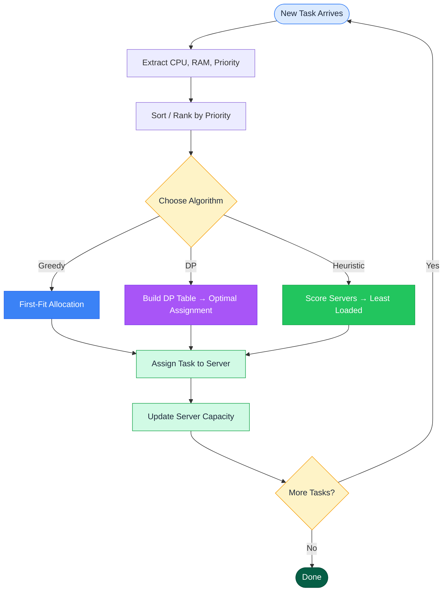
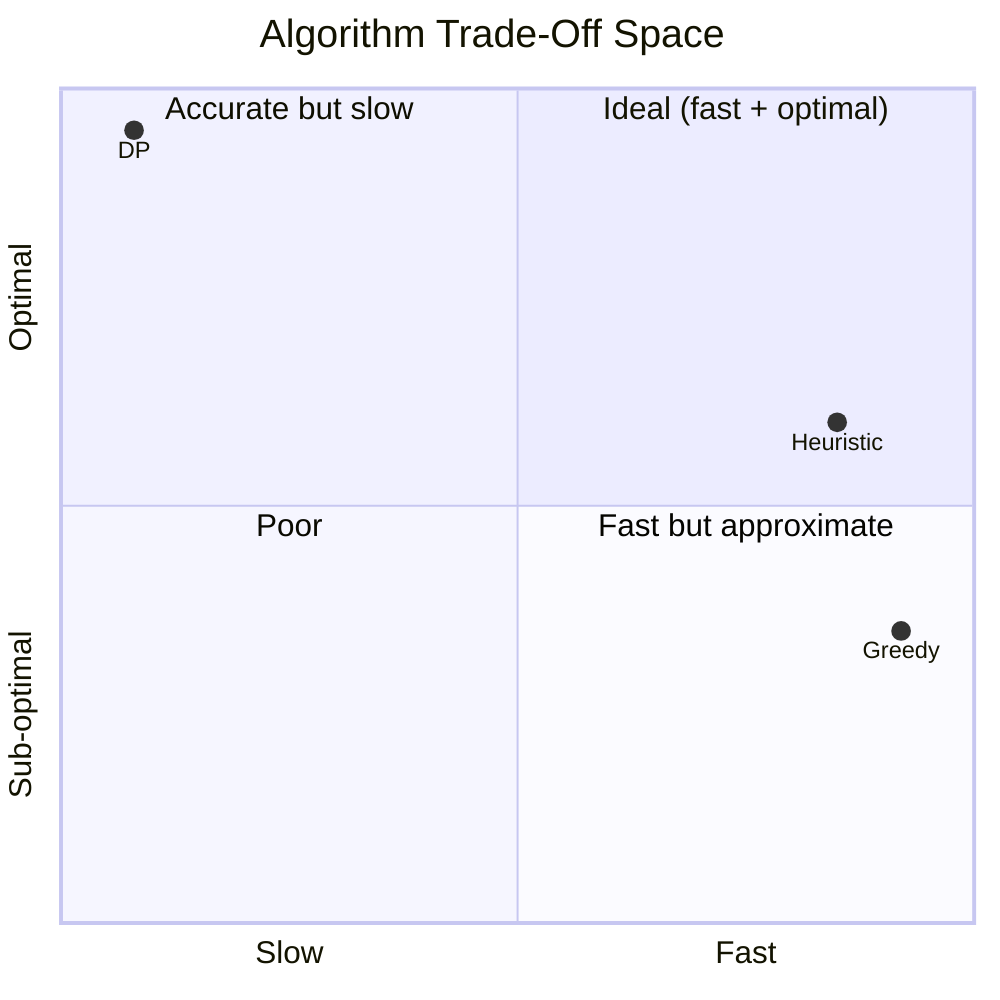

# Cloud Resource Allocation in Cloud Computing Systems

> **Course:** Analysis & Design of Algorithms  
> **University:** Tanta University — Faculty of Engineering  
> **Student:** Mohamed Tamer Atef Al-Aweshi (31156629)  
> **Instructor:** Eng. Omar Khaled  
> **Date:** May 2026

---

## Overview

This project compares three algorithmic approaches for assigning virtual machines
and resources to tasks based on **CPU, RAM, and Priority** in a cloud computing
environment:

| # | Algorithm | Strategy | Complexity |
|---|-----------|----------|------------|
| 1 | **Greedy (First-Fit)** | Sort by priority, assign to first available server | O(n·m) |
| 2 | **Dynamic Programming** | 2-D Knapsack per server, optimal selection | O(n·C·R) |
| 3 | **Heuristic Load Balancing** | Score servers by remaining capacity, pick least loaded | O(n·m) |

---

## Why Go?

We chose **Go (Golang)** as the primary implementation language for benchmarking:

| Reason | Detail |
|--------|--------|
| **Kubernetes is Go** | The world’s most-used cloud scheduler is written in Go. Our benchmarks use the same language, data structures, and patterns as production systems. |
| **Compiled → honest timings** | Go compiles to native machine code, so execution times reflect true algorithmic cost without interpreter overhead. |
| **Built-in benchmarks** | `go test -bench=.` provides statistically reliable timing with zero third-party dependencies. |
| **Readable** | Go’s minimal syntax reads almost like pseudocode — ideal for an academic report. |

Python is still used for **chart generation** (matplotlib), reading the JSON output from Go.

---

## Repository Structure

```
CloudResourceAllocation/
├── report.html                  # Full academic report (open in browser)
├── style.css                    # Report stylesheet (print/PDF-ready)
├── requirements.txt             # Python dependencies (matplotlib, numpy)
├── README.md                    # This file
├── src/
│   ├── go.mod                   # Go module definition
│   ├── allocator/               # Go package: algorithms + evaluation
│   │   ├── types.go             # Task, Server, Allocation types
│   │   ├── greedy.go            # Greedy first-fit algorithm
│   │   ├── dp.go                # 2-D knapsack DP algorithm
│   │   ├── heuristic.go         # Weighted least-loaded heuristic
│   │   ├── eval.go              # Metrics evaluation
│   │   ├── generate.go          # Task/server generation
│   │   └── allocator_test.go    # Unit tests + Go benchmarks
│   ├── cmd/benchmark/main.go    # CLI: runs benchmarks, writes JSON
│   └── generate_visuals.py      # Reads JSON, generates chart PNGs (Python)
├── results/
│   └── benchmark.json           # Machine-readable Go benchmark output
└── diagrams/                    # 10 generated PNG charts
```

---

## Quick Start

```bash
# 1. Run Go tests (verify correctness)
cd src
go test ./allocator/ -v

# 2. Run Go benchmarks (optional, shows ns/op)
go test -run=XXX -bench=Benchmark -benchmem cloud-alloc/allocator

# 3. Run the benchmark CLI (generates results/benchmark.json)
go run ./cmd/benchmark/
cd ..

# 4. Install Python deps & generate charts
pip install -r requirements.txt
python src/generate_visuals.py

# 5. Open the report
start report.html          # Windows
```

---

## Exporting to PDF

1. Open `report.html` in **Google Chrome** or **Microsoft Edge**.
2. Press **Ctrl + P**.
3. Set **Destination** → **Save as PDF**.
4. Under **More settings**, enable **Background graphics**.
5. Set margins to **Default** or **None**.
6. Click **Save**.

The report has a dedicated `@media print` stylesheet that handles page breaks,
colour preservation, and proper sizing.

---

## Allocation Workflow



---

## Benchmark Results (50 tasks × 5 servers, Go)

| Metric | Greedy | DP | Heuristic |
|--------|-------:|---:|----------:|
| Tasks placed | 16 / 50 | 20 / 50 | 16 / 50 |
| Priority score | 124 | 147 | 133 |
| Avg CPU utilisation | 82.5% | 95.0% | 80.0% |
| Avg RAM utilisation | 90.6% | 98.8% | 97.5% |
| CPU load imbalance | 50.0% | 18.8% | 31.3% |
| Execution time | 0.011 ms | 0.89 ms | 0.006 ms |

> All values from Go benchmark runs (`src/cmd/benchmark/main.go`) with seed 42.
> Go `testing.B` results: Greedy ~6 µs, DP ~623 µs, Heuristic ~6 µs per operation (50 tasks).

---

## Algorithm Comparison



---

## Key Takeaway

There is no single "best" algorithm for cloud resource allocation:

- **Greedy** → ultra-fast, simple, best for latency-critical paths
- **DP** → provably optimal, best for offline planning and small instances
- **Heuristic** → best balance of speed, quality, and load distribution

Production systems like **Kubernetes**, **AWS EC2**, and **Google Borg** use a
**hybrid approach**: greedy pre-filtering + heuristic scoring + periodic DP
rebalancing.

---

## License

Academic project — Tanta University, Faculty of Engineering, 2026.
